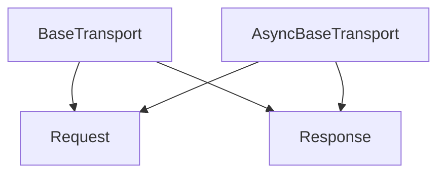

# `base_abstract_transports`

The `base_abstract_transports` module provides the foundational abstract base classes for implementing HTTP transports in both synchronous and asynchronous contexts within the `httpx` library. It defines the core interfaces that concrete transport implementations must adhere to, ensuring a consistent contract for sending HTTP requests and receiving responses.

## Architecture and Component Relationships

This module contains two primary abstract classes: `BaseTransport` for synchronous operations and `AsyncBaseTransport` for asynchronous operations. These classes establish the basic lifecycle methods for transports, including request handling and resource management.

<!-- DIAGRAM_JSON
{
    "direction": "TD",
    "nodes": [
        {"id": "base_transport", "label": "BaseTransport", "type": "component", "link": null},
        {"id": "async_base_transport", "label": "AsyncBaseTransport", "type": "component", "link": null},
        {"id": "request", "label": "Request", "type": "external", "link": "models.md"},
        {"id": "response", "label": "Response", "type": "external", "link": "models.md"}
    ],
    "edges": [
        {"source": "base_transport", "target": "request"},
        {"source": "base_transport", "target": "response"},
        {"source": "async_base_transport", "target": "request"},
        {"source": "async_base_transport", "target": "response"}
    ],
    "groups": []
}
-->

### Core Components

#### `BaseTransport`

The `BaseTransport` class serves as the abstract base for synchronous HTTP transport implementations. It defines the following essential methods:

*   `handle_request(self, request: Request) -> Response`: This abstract method is responsible for sending a single synchronous HTTP request and returning a `Response`. Implementations must provide the logic for network communication.
*   `close(self) -> None`: A method to clean up and release any network resources held by the transport.
*   `__enter__` and `__exit__`: These methods enable `BaseTransport` instances to be used as context managers, ensuring that `close()` is called automatically upon exiting the context.

Developers implementing synchronous transports should inherit from `BaseTransport` and provide concrete implementations for `handle_request` and `close`.

#### `AsyncBaseTransport`

The `AsyncBaseTransport` class is the asynchronous counterpart to `BaseTransport`. It provides the abstract interface for asynchronous HTTP transport implementations and includes:

*   `handle_async_request(self, request: Request) -> Response`: An abstract asynchronous method for sending an HTTP request and returning a `Response` in an `async` context.
*   `aclose(self) -> None`: An asynchronous method for cleaning up resources.
*   `__aenter__` and `__aexit__`: These async context manager methods ensure that `aclose()` is awaited and called when the transport exits an `async with` block.

Asynchronous transport implementations must inherit from `AsyncBaseTransport` and implement `handle_async_request` and `aclose`.

## Integration with the Overall System

The `base_abstract_transports` module is a fundamental building block for `httpx`'s extensible transport layer. By providing these abstract interfaces, it allows for various concrete transport implementations (e.g., [default_http_transports.md](default_http_transports.md), [asgi_transports.md](asgi_transports.md), [wsgi_transports.md](wsgi_transports.md), [mock_transport.md](mock_transport.md)) to be plugged into the client without requiring changes to the core client logic. This design promotes modularity and allows `httpx` to support different underlying network backends or integration points (like ASGI or WSGI applications).

Both `BaseTransport` and `AsyncBaseTransport` rely on the `Request` and `Response` models defined in the [models.md](models.md) module to represent HTTP communications.
