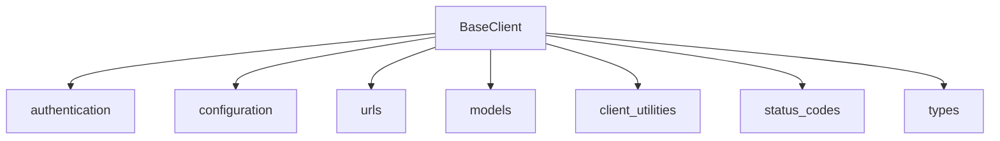

# base_client_core Module Documentation

## Introduction

The `base_client_core` module defines the `BaseClient` class, which serves as the foundational component for both synchronous and asynchronous HTTP clients within the system. It encapsulates core functionalities such as request parameter management, URL handling, authentication, and redirect processing, providing a consistent base for all client interactions.

## Architecture and Component Relationships

The `BaseClient` class is a central piece of the client architecture, establishing common behaviors and properties that are extended by specific client implementations like `AsyncClient` and `Client`. It relies on several other modules for its functionality, including those for authentication, configuration, URL parsing, and HTTP models.

<!-- DIAGRAM_JSON
{
    "direction": "TD",
    "nodes": [
        {"id": "base_client", "label": "BaseClient", "type": "component", "link": null},
        {"id": "authentication", "label": "authentication", "type": "external", "link": "authentication.md"},
        {"id": "configuration", "label": "configuration", "type": "external", "link": "configuration.md"},
        {"id": "urls", "label": "urls", "type": "external", "link": "urls.md"},
        {"id": "models", "label": "models", "type": "external", "link": "models.md"},
        {"id": "client_utilities", "label": "client_utilities", "type": "external", "link": "client_utilities.md"},
        {"id": "status_codes", "label": "status_codes", "type": "external", "link": "status_codes.md"},
        {"id": "types", "label": "types", "type": "external", "link": "types.md"}
    ],
    "edges": [
        {"source": "base_client", "target": "authentication"},
        {"source": "base_client", "target": "configuration"},
        {"source": "base_client", "target": "urls"},
        {"source": "base_client", "target": "models"},
        {"source": "base_client", "target": "client_utilities"},
        {"source": "base_client", "target": "status_codes"},
        {"source": "base_client", "target": "types"}
    ],
    "groups": []
}
-->

### `BaseClient` Component

#### Purpose

The `BaseClient` class provides the core logic and common functionalities for all HTTP client instances. It manages default request parameters, handles URL merging, implements authentication mechanisms, and orchestrates the redirect logic, ensuring a consistent and robust base for HTTP communication.

#### Key Attributes

- `auth`: (Read/Write) An instance of `Auth` or a callable for authentication. Defaults to `None`.
- `params`: (Read/Write) `QueryParams` object containing default URL query parameters.
- `headers`: (Read/Write) `Headers` object containing default HTTP headers, including standard headers like `Accept`, `Accept-Encoding`, `Connection`, and `User-Agent`.
- `cookies`: (Read/Write) `Cookies` object managing default cookie values.
- `timeout`: (Read/Write) A `Timeout` object specifying the default timeout configuration for requests.
- `follow_redirects`: (Read/Write) A boolean indicating whether the client should automatically follow HTTP redirects.
- `max_redirects`: (Read/Write) An integer specifying the maximum number of redirects to follow.
- `event_hooks`: (Read/Write) A dictionary containing lists of `EventHook` callables for `request` and `response` events.
- `base_url`: (Read/Write) The base URL (`URL` object) used for resolving relative URLs in requests.
- `trust_env`: (Read/Write) A boolean indicating whether to read proxy configurations from environment variables.
- `default_encoding`: (Read/Write) The default encoding to use for decoding response content.
- `is_closed`: (Read-only) A property indicating whether the client is closed.

#### Key Methods

- `__init__(...)`: Initializes a new `BaseClient` instance with the provided configuration parameters. It sets up authentication, query parameters, headers, cookies, timeouts, redirect behavior, event hooks, and the base URL.

- `build_request(method, url, ..., extensions)`: Constructs a `Request` object. This method is crucial as it merges client-level settings (like `base_url`, `headers`, `cookies`, `params`, `timeout`) with the request-specific arguments, creating a fully formed `Request` ready for sending.

- `_merge_url(url)`: Merges a given URL with the client's `base_url`, ensuring correct handling of relative and absolute URLs and maintaining a trailing slash for the base URL.

- `_merge_cookies(cookies)`: Merges request-specific cookies with the client's default cookies.

- `_merge_headers(headers)`: Merges request-specific headers with the client's default headers.

- `_merge_queryparams(params)`: Merges request-specific query parameters with the client's default query parameters.

- `_build_auth(auth)`: A private helper method that converts various authentication input types (`AuthTypes`, tuples, callables) into an `Auth` instance.

- `_build_request_auth(request, auth)`: Determines the effective `Auth` instance for a given request, considering both client-level authentication and request-specific authentication, as well as URL-embedded credentials.

- `_build_redirect_request(request, response)`: Generates a new `Request` object suitable for following a redirect, adjusting the HTTP method, URL, headers, and stream as necessary based on redirect rules and status codes (e.g., handling 301, 302, 303 redirects).

- `_redirect_method(request, response)`: Determines the appropriate HTTP method for a redirect request based on the response status code and original request method.

- `_redirect_url(request, response)`: Extracts and resolves the redirect URL from the `Location` header, handling relative URLs and potential malformed headers.

- `_redirect_headers(request, url, method)`: Adjusts headers for a redirect request, removing sensitive headers like `Authorization` for cross-origin redirects and updating `Host`.

- `_redirect_stream(request, method)`: Determines whether to include the original request's stream in the redirect request.

- `_set_timeout(request)`: Ensures that a timeout configuration is applied to the request's extensions if not already present.

## How the Module Fits into the Overall System

The `base_client_core` module, through its `BaseClient` class, acts as the bedrock for all HTTP client operations. It provides the common infrastructure that `async_client_core` and `sync_client_core` build upon to offer their respective asynchronous and synchronous interfaces. By centralizing core logic like request construction, parameter management, and redirect handling, `BaseClient` promotes code reusability and consistency across the entire HTTP client implementation, simplifying the development and maintenance of both `AsyncClient` and `Client` classes. It interacts with various other modules to perform its duties, including:

- **authentication**: For handling different authentication schemes.
- **configuration**: For managing client-wide settings like timeouts and proxies.
- **urls**: For robust URL parsing, merging, and manipulation.
- **models**: For constructing and manipulating core HTTP objects like `Request`, `Response`, `Headers`, and `Cookies`.
- **client_utilities**: For shared client-related utilities like `UseClientDefault` and `ClientState`.
- **status_codes**: For interpreting HTTP status codes during redirect handling.
- **types**: For defining various type hints used throughout the client library.

This modular design ensures that client implementations are flexible, extensible, and adhere to a common set of behaviors, making the overall system more predictable and easier to understand.