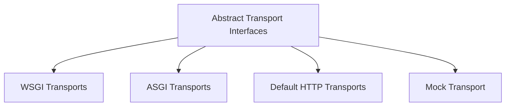

# Base Transports Module Documentation

## Introduction

The `base_transports` module in `httpx` defines the foundational interfaces for both synchronous and asynchronous HTTP transport mechanisms. It establishes the contract that all concrete transport implementations must adhere to, ensuring consistency and extensibility across different network backends and testing scenarios. This module is critical for building robust and adaptable HTTP clients.

## Architecture Overview

The `base_transports` module provides the core abstract classes that other specific transport implementations (like ASGI, WSGI, Default HTTP, and Mock transports) extend. This design promotes a clear separation of concerns, allowing different transport mechanisms to be plugged into the HTTPX client while maintaining a unified interface.

<!-- DIAGRAM_JSON
{
    "direction": "TD",
    "nodes": [
        {"id": "abstract_transports", "label": "Abstract Transport Interfaces", "type": "module", "link": "abstract_transports.md"},
        {"id": "wsgi_transports", "label": "WSGI Transports", "type": "module", "link": "wsgi_transports.md"},
        {"id": "asgi_transports", "label": "ASGI Transports", "type": "module", "link": "asgi_transports.md"},
        {"id": "default_http_transports", "label": "Default HTTP Transports", "type": "module", "link": "default_http_transports.md"},
        {"id": "mock_transport", "label": "Mock Transport", "type": "module", "link": "mock_transport.md"}
    ],
    "edges": [
        {"source": "abstract_transports", "target": "wsgi_transports"},
        {"source": "abstract_transports", "target": "asgi_transports"},
        {"source": "abstract_transports", "target": "default_http_transports"},
        {"source": "abstract_transports", "target": "mock_transport"}
    ],
    "groups": []
}
-->

## Sub-modules

### Abstract Transport Interfaces

This sub-module defines the `BaseTransport` and `AsyncBaseTransport` classes, which serve as the abstract base classes for all synchronous and asynchronous HTTP transports in `httpx`. These classes mandate the implementation of `handle_request`/`handle_async_request` and resource management methods (`close`/`aclose`), ensuring a consistent API for all transport mechanisms.

For more detailed information, refer to the [Abstract Transport Interfaces](abstract_transports.md) documentation.
