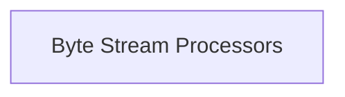

# Byte Stream Processors

Manages the processing of byte streams, specifically handling the chunking of byte content into fixed-size segments.

## Components

This module contains 1 component(s):

- `httpx._decoders.ByteChunker`

## Structure

---
*This documentation was auto-generated to ensure completeness.*
