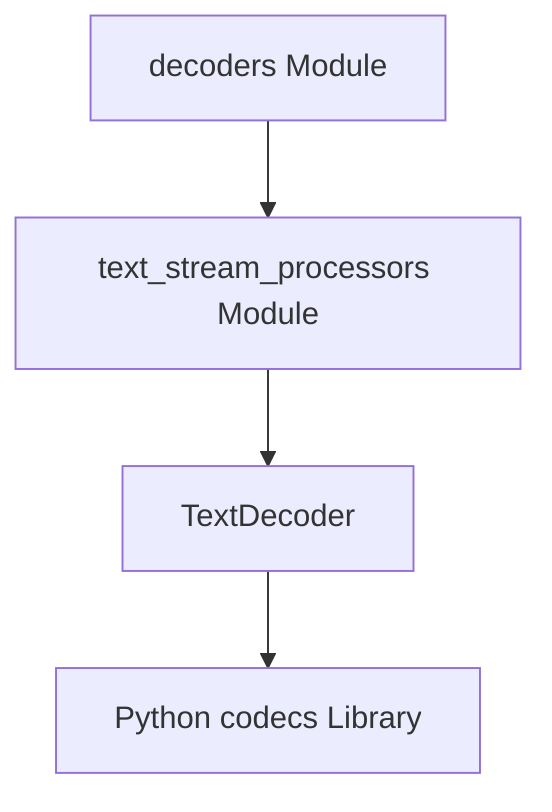

# byte_to_text_decoding Module Documentation

## Introduction

The `byte_to_text_decoding` module provides the core functionality for incrementally decoding byte streams into human-readable text. This is a critical step in processing network responses, ensuring that binary data received over HTTP is correctly interpreted according to its specified character encoding.

## Architecture and Core Functionality

This module primarily encapsulates the `TextDecoder` class, which acts as an incremental decoder. It handles the complex task of converting raw bytes into strings, managing various character encodings and error handling during the decoding process. This capability is essential for any application dealing with text-based data from external sources.

### `TextDecoder` Component

The `TextDecoder` class is designed to:
- **Initialize with Encoding**: Be initialized with a specific character encoding (e.g., "utf-8", "latin-1"). It leverages Python's `codecs` module to obtain an incremental decoder tailored to the chosen encoding.
- **Incremental Decoding**: Process chunks of bytes progressively using its `decode` method. This allows for efficient handling of large data streams without needing to load the entire stream into memory before decoding.
- **Flush Remaining Data**: Provide a `flush` method to retrieve any remaining buffered text after all byte data has been processed, ensuring all characters are properly decoded.

## Relationship to Other Modules

The `byte_to_text_decoding` module is a leaf module within the `text_stream_processors` sub-module, which in turn is part of the broader `decoders` module.

- **Parent Module (`text_stream_processors`)**: The `text_stream_processors` module orchestrates various text-related stream processing tasks, including chunking text and decoding lines. The `TextDecoder` is a fundamental component within this hierarchy, providing the basic byte-to-text conversion that other text processors might rely on.
- **Grandparent Module (`decoders`)**: The `decoders` module is the top-level container for all decoding functionalities within `httpx`, encompassing content-encoding decoders (like gzip, brotli) and stream processors. The `byte_to_text_decoding` module's role is to ensure that once content-encodings are handled, the resulting bytes can be correctly translated into text.

<!-- DIAGRAM_JSON
{
    "direction": "TD",
    "nodes": [
        {"id": "text_decoder_class", "label": "TextDecoder", "type": "component", "link": null},
        {"id": "text_stream_processors", "label": "text_stream_processors Module", "type": "external", "link": "text_stream_processors.md"},
        {"id": "decoders_module", "label": "decoders Module", "type": "external", "link": "decoders.md"},
        {"id": "codecs_module", "label": "Python codecs Library", "type": "external", "link": null}
    ],
    "edges": [
        {"source": "text_decoder_class", "target": "codecs_module"},
        {"source": "text_stream_processors", "target": "text_decoder_class"},
        {"source": "decoders_module", "target": "text_stream_processors"}
    ],
    "groups": []
}
-->

