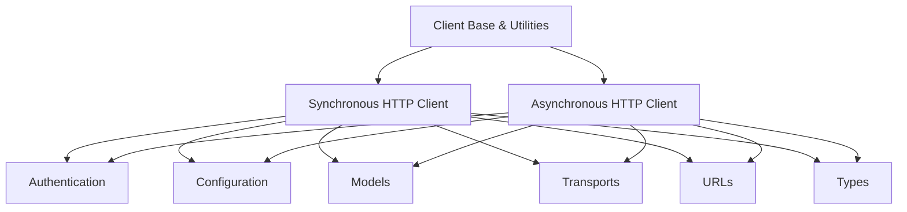

# Client Module Documentation

The `client` module in `httpx` provides the core functionality for making HTTP requests. It offers both synchronous and asynchronous clients, built upon a common base, to handle various aspects of HTTP communication, including connection pooling, redirects, cookies, and authentication.

## Architecture Overview

The client module is structured to provide a flexible and extensible way to interact with HTTP services. It separates core client logic from specific synchronous or asynchronous implementations and integrates with other `httpx` modules for features like authentication, URL parsing, and transport layers.

<!-- DIAGRAM_JSON
{
    "direction": "TD",
    "nodes": [
        {"id": "client_base", "label": "Client Base & Utilities", "type": "module", "link": "client_base.md"},
        {"id": "sync_client", "label": "Synchronous HTTP Client", "type": "module", "link": "sync_client.md"},
        {"id": "async_client", "label": "Asynchronous HTTP Client", "type": "module", "link": "async_client.md"},
        {"id": "authentication", "label": "Authentication", "type": "external", "link": "authentication.md"},
        {"id": "configuration", "label": "Configuration", "type": "external", "link": "configuration.md"},
        {"id": "models", "label": "Models", "type": "external", "link": "models.md"},
        {"id": "transports", "label": "Transports", "type": "external", "link": "transports.md"},
        {"id": "urls", "label": "URLs", "type": "external", "link": "urls.md"},
        {"id": "types", "label": "Types", "type": "external", "link": "types.md"}

    ],
    "edges": [
        {"source": "client_base", "target": "sync_client"},
        {"source": "client_base", "target": "async_client"},
        {"source": "sync_client", "target": "authentication"},
        {"source": "sync_client", "target": "configuration"},
        {"source": "sync_client", "target": "models"},
        {"source": "sync_client", "target": "transports"},
        {"source": "sync_client", "target": "urls"},
        {"source": "sync_client", "target": "types"},
        {"source": "async_client", "target": "authentication"},
        {"source": "async_client", "target": "configuration"},
        {"source": "async_client", "target": "models"},
        {"source": "async_client", "target": "transports"},
        {"source": "async_client", "target": "urls"},
        {"source": "async_client", "target": "types"}
    ],
    "groups": []
}
-->
```



## Sub-modules

### [Client Base & Utilities](client_base.md)
This sub-module ([`client_base.md`](client_base.md)) provides the foundational elements for both synchronous and asynchronous clients. It includes `BaseClient` which encapsulates common logic, `UseClientDefault` for handling default parameter values, and `ClientState` to manage the lifecycle of client instances.

### [Synchronous HTTP Client](sync_client.md)
This sub-module ([`sync_client.md`](sync_client.md)) implements the `Client` class, offering a synchronous interface for making HTTP requests. It handles blocking I/O operations and integrates with `BoundSyncStream` for managing synchronous response streams.

### [Asynchronous HTTP Client](async_client.md)
This sub-module ([`async_client.md`](async_client.md)) provides the `AsyncClient` class for non-blocking HTTP operations. It is designed for use in `async/await` contexts and works with `BoundAsyncStream` for efficient asynchronous response streaming.

## Relationships to Other Modules

The `client` module relies on several other modules within `httpx` to provide its full functionality:

*   **[Authentication](authentication.md)**: Integrates with the `authentication` module for handling various authentication schemes.
*   **[Configuration](configuration.md)**: Utilizes the `configuration` module for managing timeouts, proxies, and connection limits.
*   **[Models](models.md)**: Employs components from the `models` module for representing HTTP requests, responses, headers, and cookies.
*   **[Transports](transports.md)**: Leverages the `transports` module for the actual network communication, abstracting away the underlying protocol details.
*   **[URLs](urls.md)**: Uses the `urls` module for parsing, manipulating, and merging URLs.
*   **[Types](types.md)**: Relies on the `types` module for common type definitions used across the library, such as `SyncByteStream` and `AsyncByteStream`.