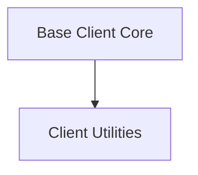

# client_base Module Documentation

## Introduction
The `client_base` module provides the fundamental building blocks and common functionalities for HTTP client implementations within the `httpx` library. It defines the core `BaseClient` class, which establishes the foundational behavior, as well as utilities for managing default values and client lifecycle states.

## Architecture
The `client_base` module is structured into the following key sub-modules:

<!-- DIAGRAM_JSON
{
    "direction": "TD",
    "nodes": [
        {"id": "base_client_core", "label": "Base Client Core", "type": "module", "link": "base_client_core.md"},
        {"id": "client_utilities", "label": "Client Utilities", "type": "module", "link": "client_utilities.md"}
    ],
    "edges": [
        {"source": "base_client_core", "target": "client_utilities"}
    ],
    "groups": []
}
-->

### Sub-modules

*   **[Base Client Core](base_client_core.md)**: Provides the foundational structure and common functionalities for HTTP clients.
*   **[Client Utilities](client_utilities.md)**: Defines default client behavior and manages the lifecycle states of an HTTP client.

## Relationships to other modules
The `client_base` module forms the foundation for higher-level client implementations like `sync_client` and `async_client`. It interacts with several other modules for its functionality:
*   [authentication](authentication.md): For handling various authentication schemes within requests.
*   [configuration](configuration.md): Utilizes `Timeout`, `Proxy`, and `Limits` for client configuration.
*   [models](models.md): Relies on `Request`, `Response`, `Headers`, `Cookies`, and `URL` for constructing and processing HTTP messages.
*   [transports](transports.md): BaseClient interacts with `BaseTransport` for sending requests.
*   [urls](urls.md): Uses `URL` and `QueryParams` for URL manipulation.
*   [types](types.md): References `SyncByteStream` and `AsyncByteStream` for stream handling.
