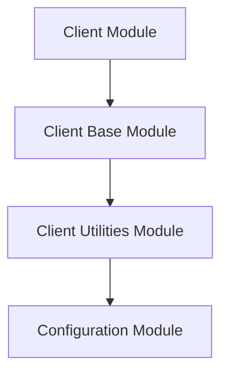

# client_utilities Module Documentation

## Introduction and Purpose

The `client_utilities` module in HTTPX provides essential utilities for managing the operational state and default parameter handling within HTTPX client instances. It defines mechanisms to differentiate between explicitly set `None` values and the use of client-level defaults for parameters like `timeout` and `auth`. This ensures flexibility and predictability in client configuration and behavior.

## Architecture Overview

The `client_utilities` module is a fundamental part of the `client` package, specifically residing under the `client_base` module. It contributes to the core functionality of HTTPX clients by managing their lifecycle and default settings. This module interacts closely with the `configuration` module, especially concerning timeout and authentication defaults, to ensure consistent client behavior.

<!-- DIAGRAM_JSON
{
    "direction": "TD",
    "nodes": [
        {"id": "client", "label": "Client Module", "type": "module", "link": "client.md"},
        {"id": "client_base", "label": "Client Base Module", "type": "module", "link": "client_base.md"},
        {"id": "client_utilities", "label": "Client Utilities Module", "type": "module", "link": "client_utilities.md"},
        {"id": "configuration", "label": "Configuration Module", "type": "module", "link": "configuration.md"}
    ],
    "edges": [
        {"source": "client", "target": "client_base"},
        {"source": "client_base", "target": "client_utilities"},
        {"source": "client_utilities", "target": "configuration"}
    ],
    "groups": []
}
-->

## High-level Functionality

The `client_utilities` module offers two primary functionalities:

*   **Default Parameter Management**: It provides a unique mechanism (`UseClientDefault`) to distinguish between the explicit disabling of a client parameter (e.g., `timeout=None`) and the intention to use the client's default setting for that parameter (e.g., `timeout` omitted or set to `USE_CLIENT_DEFAULT`). This prevents unintended override of client-wide configurations.
*   **Client State Management**: Through the `ClientState` enumeration, the module clearly defines and tracks the lifecycle stages of an HTTPX client, from instantiation to being opened for requests, and finally to being closed. This is crucial for proper resource management and ensuring the client operates within expected states.

## Core Components

### `httpx._client.UseClientDefault`

This class serves as a sentinel value to indicate that a parameter should defer to the client's default setting rather than being explicitly set to `None`. This is particularly useful for parameters like `auth` and `timeout`, where `None` has a specific meaning (e.g., no timeout) that is distinct from using the client's pre-configured default. User code typically won't interact with `UseClientDefault` directly, but it's vital for the internal handling of optional client parameters.

### `httpx._client.ClientState`

An enumeration that defines the possible states of an HTTPX client during its lifecycle. The states include:

*   **`UNOPENED`**: The client has been instantiated but has not yet been used to send a request or entered a `with` block.
*   **`OPENED`**: The client is actively sending requests or is within a `with` block, indicating it's ready for operations.
*   **`CLOSED`**: The client has either exited its `with` block or its `close()` method has been explicitly called, signifying that resources associated with the client should be released.

This enumeration is crucial for managing client resources and ensuring correct operational flow throughout the application.
