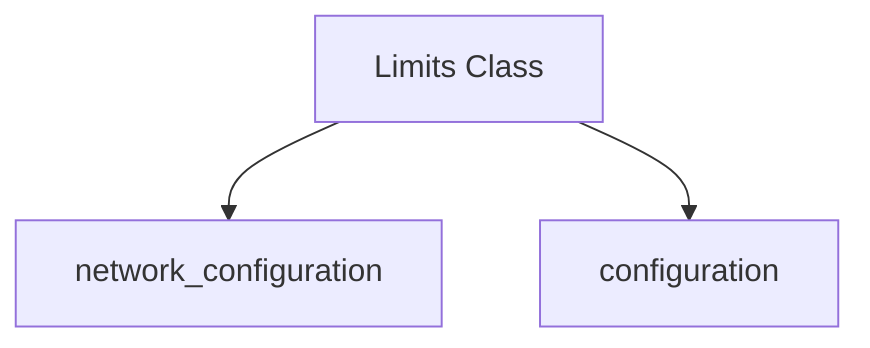

The `connection_limits` module is responsible for defining and managing various limits related to network connections within the HTTPX client. It provides a structured way to configure parameters such as the maximum number of concurrent connections and the behavior of keep-alive connections.

This module is a sub-module of `network_configuration` and `configuration`, indicating its role in the broader network and client configuration aspects of the system.

### Core Functionality

The `connection_limits` module primarily exposes the `Limits` class, which encapsulates the configuration for connection pooling and management. This class allows developers to fine-tune the client's resource usage and behavior under different network conditions.

### Architecture and Component Relationships

The `connection_limits` module is a self-contained unit focused on connection limit configurations. It directly contains the `Limits` component. It is a part of the `network_configuration` module, which itself is part of the `configuration` module, indicating a clear hierarchy in the system's configuration structure.

<!-- DIAGRAM_JSON
{
    "direction": "TD",
    "nodes": [
        {"id": "limits_class", "label": "Limits Class", "type": "component", "link": null},
        {"id": "network_configuration", "label": "network_configuration", "type": "external", "link": "network_configuration.md"},
        {"id": "configuration", "label": "configuration", "type": "external", "link": "configuration.md"}
    ],
    "edges": [
        {"source": "limits_class", "target": "network_configuration"},
        {"source": "limits_class", "target": "configuration"}
    ],
    "groups": []
}
-->


### Components

#### `httpx._config.Limits`

The `Limits` class is the central component of this module. It allows for the configuration of connection-related constraints:

*   **`max_connections`**: Defines the maximum number of concurrent connections that the client can establish. A value of `None` indicates no explicit limit.
*   **`max_keepalive_connections`**: Specifies the maximum number of idle keep-alive connections that the connection pool can maintain. This should ideally be less than or equal to `max_connections`.
*   **`keepalive_expiry`**: Sets a time limit (in seconds) for how long an idle keep-alive connection will be maintained before being closed. The default is 5.0 seconds.

**Code Snippet:**

```python
class Limits:
    """
    Configuration for limits to various client behaviors.

    **Parameters:**

    * **max_connections** - The maximum number of concurrent connections that may be
            established.
    * **max_keepalive_connections** - Allow the connection pool to maintain
            keep-alive connections below this point. Should be less than or equal
            to `max_connections`.
    * **keepalive_expiry** - Time limit on idle keep-alive connections in seconds.
    """

    def __init__(
        self,
        *,
        max_connections: int | None = None,
        max_keepalive_connections: int | None = None,
        keepalive_expiry: float | None = 5.0,
    ) -> None:
        self.max_connections = max_connections
        self.max_keepalive_connections = max_keepalive_connections
        self.keepalive_expiry = keepalive_expiry

    def __eq__(self, other: typing.Any) -> bool:
        return (
            isinstance(other, self.__class__)
            and self.max_connections == other.max_connections
            and self.max_keepalive_connections == other.max_keepalive_connections
            and self.keepalive_expiry == other.keepalive_expiry
        )

    def __repr__(self) -> str:
        class_name = self.__class__.__name__
        return (
            f"{class_name}(max_connections={self.max_connections}, "
            f"max_keepalive_connections={self.max_keepalive_connections}, "
            f"keepalive_expiry={self.keepalive_expiry})"
        )

```

### How it Fits into the Overall System

The `connection_limits` module, through its `Limits` class, is a critical part of the overall [configuration](configuration.md) and [network_configuration](network_configuration.md) modules. It provides the granular control necessary for managing the HTTPX client's connection resources, which directly impacts performance, stability, and resource consumption.

By allowing developers to define these limits, the system can prevent resource exhaustion, manage concurrent requests efficiently, and optimize the use of persistent connections, contributing to a more robust and scalable application.