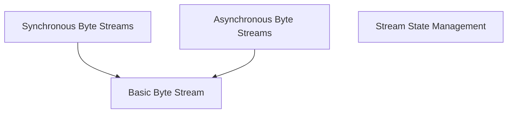

# Content Module Documentation

The `content` module in `httpx` is responsible for defining and managing various types of byte streams used for handling request and response bodies. It provides abstractions for both synchronous and asynchronous iteration over byte data, catering to different data sources like iterables, async iterables, and raw byte strings. This module ensures efficient and flexible content handling within the HTTP client.

## Architecture Overview

The `content` module is structured around different stream implementations to facilitate flexible and efficient handling of HTTP message bodies. It provides distinct classes for synchronous and asynchronous stream processing, a basic stream for raw bytes, and a mechanism for handling unattached or closed streams.

<!-- DIAGRAM_JSON
{
    "direction": "TD",
    "nodes": [
        {"id": "synchronous_streams", "label": "Synchronous Byte Streams", "type": "module", "link": "synchronous_streams.md"},
        {"id": "asynchronous_streams", "label": "Asynchronous Byte Streams", "type": "module", "link": "asynchronous_streams.md"},
        {"id": "basic_byte_stream", "label": "Basic Byte Stream", "type": "module", "link": "basic_byte_stream.md"},
        {"id": "stream_state_management", "label": "Stream State Management", "type": "module", "link": "stream_state_management.md"}
    ],
    "edges": [
        {"source": "synchronous_streams", "target": "basic_byte_stream"},
        {"source": "asynchronous_streams", "target": "basic_byte_stream"}
    ],
    "groups": []
}
-->

## Sub-modules

This module is divided into the following sub-modules, each addressing a specific aspect of content handling:

*   **[Synchronous Byte Streams](synchronous_streams.md)**: This sub-module focuses on iterators for synchronous processing of byte streams, allowing efficient handling of data from various iterable sources.
*   **[Asynchronous Byte Streams](asynchronous_streams.md)**: This sub-module provides asynchronous iterators for byte streams, crucial for non-blocking I/O operations and integration with `async/await` patterns.
*   **[Basic Byte Stream](basic_byte_stream.md)**: This sub-module offers a straightforward implementation for wrapping a raw `bytes` object into a stream that supports both synchronous and asynchronous iteration.
*   **[Stream State Management](stream_state_management.md)**: This sub-module deals with the representation and behavior of streams that are no longer active or have been closed, ensuring proper error handling for invalid stream access attempts.
