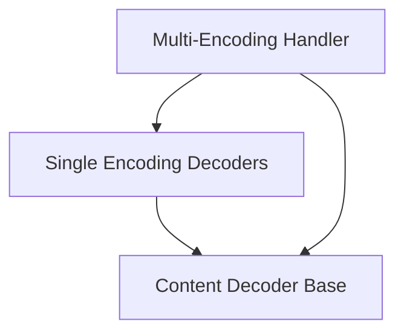

# Content Encoding Decoders Module

## Introduction and Purpose

The `content_encoding_decoders` module within `httpx._decoders` is responsible for handling various HTTP content encodings. It provides a flexible framework for decompressing and transforming encoded response bodies, ensuring that the client receives the original, unencoded data. This module supports a range of common encoding schemes like Gzip, Deflate, Brotli, and Zstandard, as well as handling cases with no encoding or multiple layered encodings.

This module is a child of the main [decoders module](decoders.md) and works closely with other components in the [content module](content.md) for streaming and processing byte streams.

## Architecture Overview

The `content_encoding_decoders` module is structured around a base decoder interface, with concrete implementations for various encoding types and a mechanism to chain multiple decoders. The architecture ensures extensibility and adherence to different content encoding standards.

<!-- DIAGRAM_JSON
{
    "direction": "TD",
    "nodes": [
        {"id": "content_decoder_base", "label": "Content Decoder Base", "type": "module", "link": "content_decoder_base.md"},
        {"id": "single_encoding_decoders", "label": "Single Encoding Decoders", "type": "module", "link": "single_encoding_decoders.md"},
        {"id": "multi_encoding_handler", "label": "Multi-Encoding Handler", "type": "module", "link": "multi_encoding_handler.md"}
    ],
    "edges": [
        {"source": "single_encoding_decoders", "target": "content_decoder_base"},
        {"source": "multi_encoding_handler", "target": "content_decoder_base"},
        {"source": "multi_encoding_handler", "target": "single_encoding_decoders"}
    ],
    "groups": []
}
-->

## Sub-modules and their Functionality

This module is composed of the following sub-modules:

*   **[Content Decoder Base](content_decoder_base.md)**:
    Provides the abstract `ContentDecoder` class, defining the fundamental `decode` and `flush` methods that all specific decoders must implement.

*   **[Single Encoding Decoders](single_encoding_decoders.md)**:
    Contains individual decoder implementations for handling specific content encodings such as `IdentityDecoder` (for unencoded data), `DeflateDecoder`, `GZipDecoder`, `BrotliDecoder`, and `ZStandardDecoder`. Each decoder manages the decompression logic for its respective encoding type.

*   **[Multi-Encoding Handler](multi_encoding_handler.md)**:
    Implements the `MultiDecoder` class, which is capable of processing responses that have been subjected to multiple layers of content encoding. It orchestrates the sequential application of an ordered list of `ContentDecoder` instances to fully decompress the data.