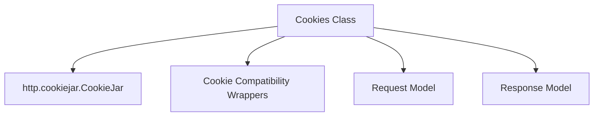

# cookie_jar_management Module Documentation

The `cookie_jar_management` module is responsible for managing HTTP cookies within the HTTPX library. It provides the `Cookies` class, a mutable mapping that encapsulates the functionality of Python's standard library `http.cookiejar.CookieJar` to handle cookie extraction from responses, setting cookie headers on requests, and general cookie manipulation.

## Purpose and Core Functionality

This module's primary purpose is to offer a robust and user-friendly interface for managing HTTP cookies. The `Cookies` class acts as the central component, allowing developers to interact with cookies as a dictionary-like object while internally handling the complexities of `Set-Cookie` and `Cookie` headers according to HTTP specifications.

Key functionalities include:

*   **Initialization**: Creating `Cookies` instances from various formats (dictionaries, lists of key-value pairs, or existing `Cookies` objects).
*   **Cookie Extraction**: Parsing `Set-Cookie` headers from `httpx.Response` objects and updating the internal cookie jar.
*   **Header Setting**: Generating appropriate `Cookie` headers for `httpx.Request` objects based on the stored cookies.
*   **Cookie Manipulation**: Methods for setting, getting, deleting, and clearing cookies by name, domain, and path.
*   **Dictionary-like Interface**: Supporting standard dictionary operations (`__getitem__`, `__setitem__`, `__delitem__`, `__len__`, `__iter__`, `__bool__`) for intuitive cookie access.

## Architecture and Component Relationships

The `cookie_jar_management` module centers around the `Cookies` class, which integrates with several other core components and modules.

<!-- DIAGRAM_JSON
{
    "direction": "TD",
    "nodes": [
        {"id": "Cookies", "label": "Cookies Class", "type": "component", "link": null},
        {"id": "http_cookiejar", "label": "http.cookiejar.CookieJar", "type": "external", "link": "https://docs.python.org/3/library/http.cookies.html#http.cookiejar.CookieJar"},
        {"id": "request_model", "label": "Request Model", "type": "external", "link": "http_messages.md#request"},
        {"id": "response_model", "label": "Response Model", "type": "external", "link": "http_messages.md#response"},
        {"id": "cookie_compat_wrappers", "label": "Cookie Compatibility Wrappers", "type": "external", "link": "cookie_compatibility_wrappers.md"}
    ],
    "edges": [
        {"source": "Cookies", "target": "http_cookiejar"},
        {"source": "Cookies", "target": "cookie_compat_wrappers"},
        {"source": "Cookies", "target": "request_model"},
        {"source": "Cookies", "target": "response_model"}
    ],
    "groups": []
}
-->

### Core Components

*   **`httpx._models.Cookies`**:
    The main class providing the public API for cookie management. It internally uses `http.cookiejar.CookieJar` to store and manage cookies. It also contains nested helper classes `_CookieCompatRequest` and `_CookieCompatResponse` to bridge `httpx`'s `Request` and `Response` objects with `http.cookiejar`'s expected interface. These compatibility wrappers are also exposed and documented in the [cookie_compatibility_wrappers module](cookie_compatibility_wrappers.md).

### External Dependencies

*   **`http.cookiejar.CookieJar` (Python Standard Library)**:
    The underlying mechanism used by the `Cookies` class for persistent storage and management of HTTP cookies. The `Cookies` class abstracts away the direct interaction with `CookieJar` for most use cases.

*   **`httpx._models.Request` and `httpx._models.Response` (from [http_messages module](http_messages.md))**:
    The `Cookies` class interacts with `Request` objects to attach `Cookie` headers and with `Response` objects to extract `Set-Cookie` headers. The internal compatibility wrappers are designed to adapt these `httpx` models for `http.cookiejar`'s methods.

*   **`cookie_compatibility_wrappers` module**:
    This module (specifically, the `_CookieCompatRequest` and `_CookieCompatResponse` classes) provides the necessary adaptation layers to allow `httpx.Request` and `httpx.Response` objects to be used with the standard Python `http.cookiejar` library.

## How the Module Fits into the Overall System

The `cookie_jar_management` module, through its `Cookies` class, is an integral part of HTTPX's automatic cookie handling. It is typically instantiated and managed by the `Client` (from the [client module](client.md)) or `AsyncClient` classes, which use it to maintain a session's cookie state across multiple requests and responses. This ensures that cookies received from a server are correctly stored and subsequently sent back with relevant requests, providing seamless session management without explicit user intervention.

By centralizing cookie logic, this module contributes to the robustness and ease of use of the HTTPX library, abstracting away low-level HTTP header manipulation for developers.