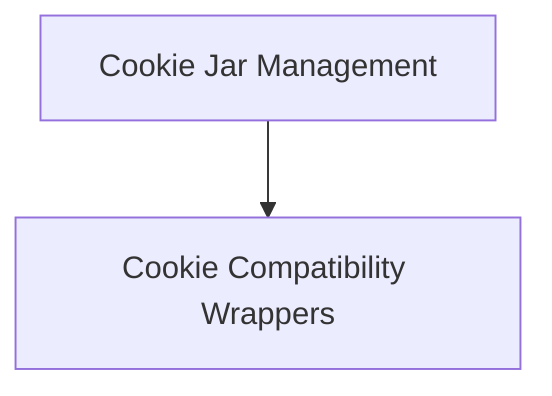

# Cookie Management Module

The `cookie_management` module, residing within `httpx._models.http_cookies`, is responsible for handling HTTP cookies within the HTTPX library. It provides a robust and flexible way to manage cookies, enabling applications to interact with web services that rely on session management.

## Architecture Overview

The `cookie_management` module is composed of two primary sub-modules: [Cookie Jar Management](cookie_jar_management.md) and [Cookie Compatibility Wrappers](cookie_compatibility_wrappers.md). The `cookie_jar_management` sub-module provides the core functionality for managing cookies, while the `cookie_compatibility_wrappers` sub-module facilitates integration with Python's standard `http.cookiejar` for seamless cookie handling.

<!-- DIAGRAM_JSON
{
    "direction": "TD",
    "nodes": [
        {"id": "cookie_jar_management", "label": "Cookie Jar Management", "type": "module", "link": "cookie_jar_management.md"},
        {"id": "cookie_compatibility_wrappers", "label": "Cookie Compatibility Wrappers", "type": "module", "link": "cookie_compatibility_wrappers.md"}
    ],
    "edges": [
        {"source": "cookie_jar_management", "target": "cookie_compatibility_wrappers"}
    ],
    "groups": []
}
-->

## High-level Functionality

*   **[Cookie Jar Management](cookie_jar_management.md)**: This sub-module (`httpx._models.Cookies`) offers a mutable mapping interface for HTTP cookies. It enables setting, retrieving, and deleting cookies, as well as extracting cookies from incoming responses and applying them to outgoing requests.
*   **[Cookie Compatibility Wrappers](cookie_compatibility_wrappers.md)**: This sub-module (`httpx._models._CookieCompatRequest`, `httpx._models._CookieCompatResponse`) provides adapter classes that allow `httpx.Request` and `httpx.Response` objects to be used with Python's `http.cookiejar` module, ensuring robust and standard-compliant cookie behavior.

## Relationship to Other Modules

The `cookie_management` module is a crucial part of the `http_cookies` sub-module within the `models` module, handling all aspects of HTTP cookie interaction. For a broader understanding of how HTTP messages are structured, refer to the [http_cookies module documentation](http_cookies.md) and the parent [models module documentation](models.md).