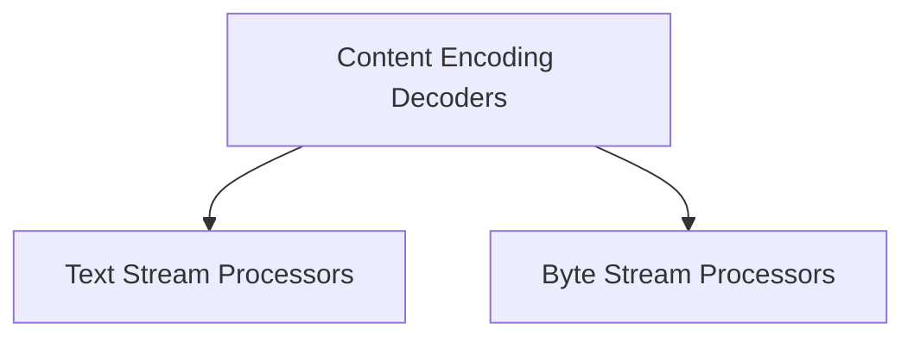

# Decoders Module Documentation

The `decoders` module in `httpx` is responsible for handling the decoding of various content types and streams. It provides a set of classes that can decode common content encodings like gzip, deflate, brotli, and zstandard, as well as utilities for processing text and byte streams into manageable chunks or lines.

This module plays a crucial role in ensuring that data received over the network can be correctly interpreted and consumed by the application, abstracting away the complexities of different encoding schemes and stream processing.

## Architecture Overview

The `decoders` module is composed of several sub-modules, each dedicated to a specific aspect of content and stream decoding. The overall architecture can be visualized as follows:

<!-- DIAGRAM_JSON
{
    "direction": "TD",
    "nodes": [
        {"id": "content_encoding_decoders", "label": "Content Encoding Decoders", "type": "module", "link": "content_encoding_decoders.md"},
        {"id": "text_stream_processors", "label": "Text Stream Processors", "type": "module", "link": "text_stream_processors.md"},
        {"id": "byte_stream_processors", "label": "Byte Stream Processors", "type": "module", "link": "byte_stream_processors.md"}
    ],
    "edges": [
        {"source": "content_encoding_decoders", "target": "text_stream_processors"},
        {"source": "content_encoding_decoders", "target": "byte_stream_processors"}
    ],
    "groups": []
}
-->

## Sub-modules

Here's a high-level overview of the sub-modules within `decoders`:

### [Content Encoding Decoders](content_encoding_decoders.md)
This sub-module focuses on the various content encoding schemes. It includes a base class `ContentDecoder` and specific implementations for `Identity`, `Deflate`, `Brotli`, `ZStandard`, and `GZip` decoding. The `MultiDecoder` is also part of this group, allowing for the chaining of multiple decoders.

### [Text Stream Processors](text_stream_processors.md)
This sub-module provides components for handling text data streams. It includes `TextDecoder` for converting bytes to text, `TextChunker` for breaking text into fixed-size chunks, and `LineDecoder` for incrementally reading lines from text.

### [Byte Stream Processors](byte_stream_processors.md)
The `byte_stream_processors` sub-module contains the `ByteChunker` component, which is designed to process raw byte streams and return their content in fixed-size byte chunks. This is useful for managing large binary data streams efficiently.