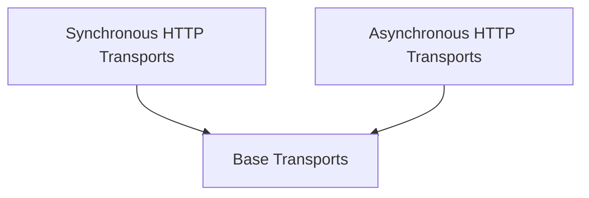

# default_http_transports Module

The `default_http_transports` module provides the core synchronous and asynchronous HTTP transport implementations for the httpx library. It handles the underlying mechanics of sending HTTP requests and receiving responses, including connection pooling, proxy support, and stream handling.

## Architecture

The `default_http_transports` module is structured into synchronous and asynchronous components, built upon the base transport interfaces. It leverages `httpcore` for low-level network operations and connection management.

<!-- DIAGRAM_JSON
{
    "direction": "TD",
    "nodes": [
        {"id": "sync_transports", "label": "Synchronous HTTP Transports", "type": "module", "link": "sync_transports.md"},
        {"id": "async_transports", "label": "Asynchronous HTTP Transports", "type": "module", "link": "async_transports.md"}
    ],
    "edges": [
        {"source": "sync_transports", "target": "base_transports"},
        {"source": "async_transports", "target": "base_transports"}
    ],
    "groups": []
}
-->

## Sub-modules

### [Synchronous HTTP Transports](sync_transports.md)
This sub-module ([`sync_transports.md`](sync_transports.md)) is responsible for managing synchronous HTTP request and response processing. It includes `HTTPTransport` for handling HTTP requests and `ResponseStream` for processing incoming response data synchronously.

### [Asynchronous HTTP Transports](async_transports.md)
This sub-module ([`async_transports.md`](async_transports.md)) provides the asynchronous capabilities for HTTP communication. It contains `AsyncHTTPTransport` for handling asynchronous HTTP requests and `AsyncResponseStream` for asynchronously processing response data.
