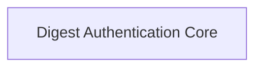

# Digest Authentication Module

## Introduction
The `digest_auth` module in HTTPX is responsible for handling Digest Access Authentication, a more secure authentication scheme than Basic Authentication. It provides the mechanisms to process `WWW-Authenticate` challenges from servers and construct the appropriate `Authorization` headers for client requests.

## Architecture Overview
The `digest_auth` module primarily focuses on the core logic required for Digest authentication. It consists of a single sub-module that encapsulates the main `DigestAuth` class and its supporting data structures.

<!-- DIAGRAM_JSON
{
    "direction": "TD",
    "nodes": [
        {"id": "digest_authentication_core", "label": "Digest Authentication Core", "type": "module", "link": "digest_authentication_core.md"}
    ],
    "edges": [],
    "groups": []
}
-->

## Sub-modules

*   **[Digest Authentication Core](digest_authentication_core.md)**: This sub-module contains the primary implementation for Digest authentication, including the `DigestAuth` class which manages the authentication flow, parses server challenges, and constructs the necessary authorization headers. It also defines the `_DigestAuthChallenge` NamedTuple for structured representation of authentication challenges.