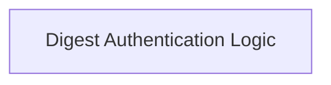

# Digest Authentication Core Module

## Introduction

The `digest_authentication_core` module provides the foundational implementation for HTTP Digest Authentication within the system. It handles the intricate process of challenging a client, parsing the authentication challenge, and generating the appropriate response based on the provided credentials. This module is critical for securing communication by ensuring that sensitive information, such as passwords, is not transmitted in plaintext.

## Architecture Overview

The `digest_authentication_core` module is structured around its core logic for processing Digest authentication challenges and responses. It encapsulates the main algorithm and helper data structures required for this authentication scheme.

<!-- DIAGRAM_JSON
{
    "direction": "TD",
    "nodes": [
        {"id": "digest_auth_logic", "label": "Digest Authentication Logic", "type": "module", "link": "digest_auth_logic.md"}
    ],
    "edges": [],
    "groups": []
}
-->

## Sub-modules

### Digest Authentication Logic ([`digest_auth_logic.md`](digest_auth_logic.md))

The `digest_auth_logic` sub-module contains the primary classes and functions responsible for executing the Digest authentication flow. This includes the `DigestAuth` class, which manages the authentication state, builds authorization headers, and processes `WWW-Authenticate` challenges, as well as the `_DigestAuthChallenge` NamedTuple, which models the parsed challenge parameters. It works closely with other authentication components in the broader [authentication.md](authentication.md) module to provide a robust authentication solution.
