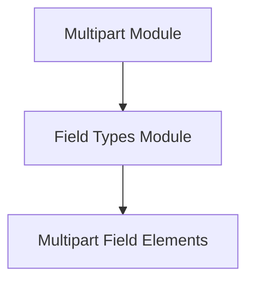

# Field Types Module

The `field_types` module, a sub-component of the [multipart](multipart.md) module, is responsible for defining the individual field types used in multipart form data. It provides classes for representing both file fields and general data fields, facilitating the structured construction and rendering of multipart requests.

## Architecture

The `field_types` module is composed of the `multipart_field_elements` sub-module, which encapsulates the core logic for handling different types of multipart form fields.

<!-- DIAGRAM_JSON
{
    "direction": "TD",
    "nodes": [
        {"id": "multipart", "label": "Multipart Module", "type": "module", "link": "multipart.md"},
        {"id": "field_types", "label": "Field Types Module", "type": "module", "link": "field_types.md"},
        {"id": "multipart_field_elements", "label": "Multipart Field Elements", "type": "module", "link": "multipart_field_elements.md"}
    ],
    "edges": [
        {"source": "multipart", "target": "field_types"},
        {"source": "field_types", "target": "multipart_field_elements"}
    ],
    "groups": []
}
-->

## Sub-modules

### [Multipart Field Elements](multipart_field_elements.md)
This sub-module defines the `FileField` and `DataField` classes, which are crucial for constructing the individual parts of a multipart form. `FileField` handles file uploads, including filename, content type, and headers, while `DataField` manages simple key-value pairs.