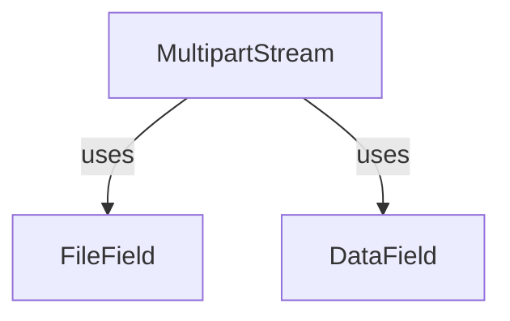

# `form_field_elements`

**Module Name:** `form_field_elements`

The `form_field_elements` module provides the foundational classes for representing individual fields within a multipart form data structure. It defines how both file uploads and standard data fields are encapsulated, processed, and prepared for transmission in HTTP requests. This module is a leaf component within the `httpx._multipart` sub-system, offering the granular representation of form elements.

## Purpose and Core Functionality

The primary purpose of this module is to abstract the complexities of handling different types of form fields, ensuring they conform to the multipart encoding standard. It provides two core classes:

1.  **`FileField`**: Designed to manage file uploads, including handling filenames, content types, and streaming file data efficiently.
2.  **`DataField`**: Handles simpler data types such as strings, bytes, integers, and floats, converting them into a suitable format for multipart forms.

Together, these classes enable the construction of robust and flexible multipart request bodies.

## Architecture and Component Relationships

This module contains two key classes, `FileField` and `DataField`, which are responsible for rendering their respective content and headers into bytes suitable for a multipart request body. Both classes implement methods for rendering headers (`render_headers`), rendering data (`render_data`), calculating content length (`get_length`), and providing a complete iterable (`render`).

### `FileField`

The `FileField` class encapsulates the logic for preparing a file for upload. It supports various input formats for files (tuples mimicking `requests`' API or file-like objects) and intelligently determines the filename and content type. It includes error checking for file-like objects to ensure they are opened in binary mode. The `render_data` method is designed to stream file content in chunks, making it efficient for large files.

### `DataField`

The `DataField` class handles non-file form data. It ensures that the provided value (string, bytes, int, float) is converted into a byte string representation suitable for direct inclusion in the multipart body. Its `render_data` method directly returns the entire data as bytes, as these fields are typically smaller.

### Internal Helpers

Both `FileField` and `DataField` rely on internal helper functions within the broader `httpx._multipart` context for tasks such as content type guessing (`_guess_content_type`), formatting form parameters (`_format_form_param`), and converting values to bytes (`to_bytes`). `FileField` also uses `peek_filelike_length` to determine the length of file-like objects without reading them entirely into memory.

## How the Module Fits into the Overall System

`form_field_elements` serves as a fundamental building block for handling multipart form data within the `httpx` library. The `FileField` and `DataField` instances created by this module are consumed by higher-level components, most notably the [multipart.md](multipart.md) module, specifically its `MultipartStream` class. `MultipartStream` uses these field elements to construct the complete multipart/form-data request body, assembling the headers and data from each field into a coherent stream for transmission.

This modular design ensures that the concerns of individual field representation are separated from the overall multipart body assembly, leading to a cleaner and more maintainable codebase.

<!-- DIAGRAM_JSON
{
    "direction": "TD",
    "nodes": [
        {"id": "file_field", "label": "FileField", "type": "component", "link": null},
        {"id": "data_field", "label": "DataField", "type": "component", "link": null},
        {"id": "multipart_stream", "label": "MultipartStream", "type": "external", "link": "multipart.md"}
    ],
    "edges": [
        {"source": "multipart_stream", "target": "file_field", "label": "uses"},
        {"source": "multipart_stream", "target": "data_field", "label": "uses"}
    ],
    "groups": []
}
-->
