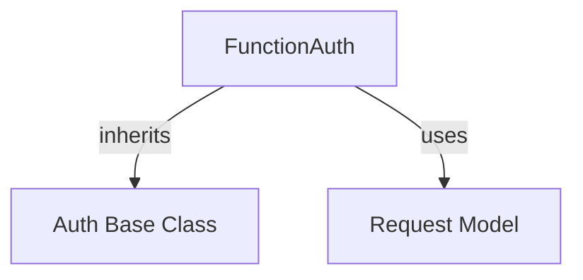

# functional_authentication

The `functional_authentication` module provides a flexible mechanism for implementing custom authentication logic using simple callable functions. It allows developers to define a function that modifies an outgoing request to include authentication credentials or headers.

## Core Functionality

The primary component of this module is `FunctionAuth`, which enables the `auth` argument in HTTPX to accept a callable. This function takes an `httpx.Request` object as input and returns a modified `httpx.Request` object, allowing for dynamic and custom authentication flows.

### `FunctionAuth`

`FunctionAuth` is an implementation of the `Auth` base class, designed to wrap a user-provided function for authentication. When an HTTPX client makes a request, `FunctionAuth` invokes the provided function with the current `Request` object. The modified `Request` returned by the function is then used for the actual network call.

**Key features:**
-   **Customizable:** Allows for any authentication scheme that can be implemented as a function modifying a request.
-   **Simple Interface:** Integrates seamlessly by accepting a standard Python callable.
-   **Integration with `auth_base`:** Inherits from `Auth`, ensuring compatibility with HTTPX's authentication framework.

## Architecture and Component Relationships

<!-- DIAGRAM_JSON
{
    "direction": "TD",
    "nodes": [
        {"id": "FunctionAuth", "label": "FunctionAuth", "type": "component", "link": null},
        {"id": "Auth", "label": "Auth Base Class", "type": "external", "link": "auth_base.md"},
        {"id": "Request", "label": "Request Model", "type": "external", "link": "models.md"}
    ],
    "edges": [
        {"source": "FunctionAuth", "target": "Auth"},
        {"source": "FunctionAuth", "target": "Request"}
    ],
    "groups": []
}
-->

## How it Fits into the Overall System

The `functional_authentication` module is a part of the broader `authentication` package within HTTPX, specifically residing under `advanced_auth`. It provides a highly flexible alternative to more specific authentication schemes like `BasicAuth` or `DigestAuth`.

Developers can leverage `FunctionAuth` when existing authentication methods don't meet their requirements, enabling them to implement complex or custom authentication logic directly. It relies on the `auth_base` module for its foundational `Auth` interface and interacts with the `models` module to manipulate `Request` objects during the authentication flow.