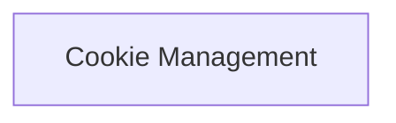

# HTTP Cookies Module

The `http_cookies` module, part of the `httpx._models` package, provides robust functionality for managing HTTP cookies within the HTTPX client. It allows for the creation, manipulation, and storage of cookies, ensuring proper handling during request and response cycles.

## Architecture Overview

This module primarily consists of components focused on cookie management and compatibility with the `http.cookiejar` standard library. The core `Cookies` class acts as a mutable mapping for cookie data, while `_CookieCompatRequest` and `_CookieCompatResponse` facilitate integration with Python's `CookieJar`.

<!-- DIAGRAM_JSON
{
    "direction": "TD",
    "nodes": [
        {"id": "cookie_management", "label": "Cookie Management", "type": "module", "link": "cookie_management.md"}
    ],
    "edges": [],
    "groups": []
}
-->

## Sub-modules

### [Cookie Management](cookie_management.md)

This sub-module encapsulates the core logic for handling HTTP cookies. It provides classes to manage cookie storage, extract cookies from responses, and attach them to requests. It bridges the gap between HTTXP's internal request/response objects and Python's standard `http.cookiejar` functionality.

