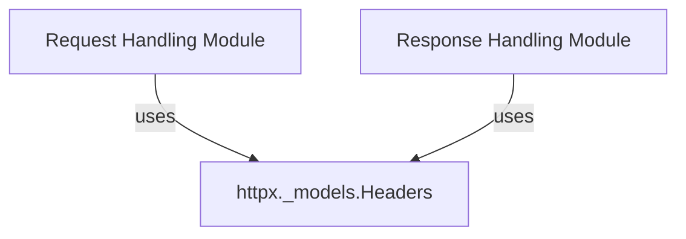

# Module: http_headers

## Introduction

The `http_headers` module, centered around the `httpx._models.Headers` class, provides a robust and flexible way to manage HTTP headers within the `httpx` library. It implements a case-insensitive multi-dict structure, which is essential for handling the complexities of HTTP header specifications, including cases where multiple header fields with the same name may be present. This module ensures proper encoding, retrieval, and manipulation of HTTP headers, making it a foundational component for building and parsing HTTP requests and responses.

## Architecture and Component Relationships

The `http_headers` module's core functionality is encapsulated within the `httpx._models.Headers` class. This class serves as a central utility for handling HTTP headers, providing an interface similar to a mutable dictionary but with added capabilities specific to HTTP header management, such as case-insensitivity and handling of multiple values for the same key.

The `Headers` class is a fundamental building block for modules that need to manage HTTP headers. Specifically, it is utilized by the [request_handling](request_handling.md) and [response_handling](response_handling.md) modules, where `Request` and `Response` objects respectively use `Headers` instances to store and manipulate their associated HTTP headers.

<!-- DIAGRAM_JSON
{
    "direction": "TD",
    "nodes": [
        {"id": "headers_class", "label": "httpx._models.Headers", "type": "component", "link": null},
        {"id": "request_handling", "label": "Request Handling Module", "type": "external", "link": "request_handling.md"},
        {"id": "response_handling", "label": "Response Handling Module", "type": "external", "link": "response_handling.md"}
    ],
    "edges": [
        {"source": "request_handling", "target": "headers_class", "label": "uses"},
        {"source": "response_handling", "target": "headers_class", "label": "uses"}
    ],
    "groups": []
}
-->

## Core Functionality

### `httpx._models.Headers` Class

The `Headers` class provides a comprehensive API for interacting with HTTP headers:

*   **Initialization**: Can be initialized from various sources, including existing `Headers` objects, dictionaries (Mappings), or lists of `(key, value)` tuples. It correctly handles header encoding during initialization.
*   **Case-Insensitivity**: All header key operations (getting, setting, deleting, checking containment) are case-insensitive, adhering to HTTP/1.1 specifications.
*   **Multi-Value Handling**: Supports multiple header fields with the same name. Methods like `items()` concatenate these into a single comma-separated string, while `multi_items()` provides access to all individual `(key, value)` pairs.
*   **Encoding Management**: Automatically detects and manages the appropriate encoding for headers (falling back from `ascii` to `utf-8` and then `iso-8859-1` if needed), ensuring proper byte-to-string conversion.
*   **Raw Access**: The `raw` property allows direct access to the underlying byte-level `(key, value)` pairs of the headers.
*   **MutableMapping Interface**: Implements the `MutableMapping` interface, providing familiar dictionary-like operations such as `__getitem__`, `__setitem__`, `__delitem__`, `__contains__`, `keys()`, `values()`, `items()`, and `update()`.
*   **Specific Retrieval Methods**:
    *   `get(key, default)`: Retrieves a header's value, concatenating multiple occurrences.
    *   `get_list(key, split_commas)`: Retrieves all values for a given header key as a list, with an option to split comma-separated values.

## How the Module Fits into the Overall System

The `http_headers` module is a fundamental utility within the `httpx` library, providing the essential data structure and logic for managing HTTP headers. It acts as a dependency for higher-level modules that construct and parse HTTP messages:

*   **HTTP Request Construction**: The [request_handling](request_handling.md) module uses `Headers` to store and manipulate the headers of outgoing HTTP requests. This includes setting `Content-Type`, `Authorization`, and other crucial request headers.
*   **HTTP Response Parsing**: The [response_handling](response_handling.md) module relies on `Headers` to parse and provide access to the headers received in HTTP responses, enabling clients to inspect metadata like `Content-Length`, `Set-Cookie`, and `Server` information.
*   **Interoperability**: By providing a consistent and robust way to handle HTTP headers, `http_headers` ensures interoperability and correctness across various parts of the `httpx` library that deal with HTTP communication. It abstracts away the complexities of header encoding, case-insensitivity, and multi-value handling, allowing other modules to focus on their primary responsibilities.
