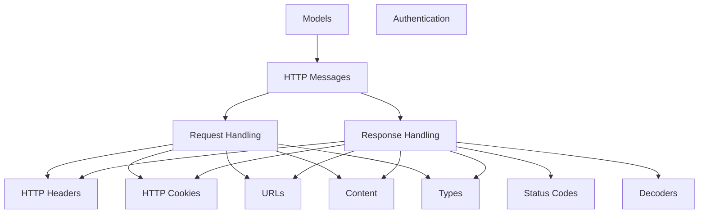

# HTTP Messages Module

The `http_messages` module in `httpx` is responsible for defining the core structures for HTTP requests and responses. It provides robust, extensible classes (`Request` and `Response`) that encapsulate all aspects of an HTTP message, from method and URL to headers, content, and streaming capabilities.

## Architecture Overview

This module primarily consists of two key components: `Request` and `Response`. The `Request` object facilitates the construction and manipulation of outgoing HTTP requests, handling aspects like URL parsing, header management, and content encoding. The `Response` object represents an incoming HTTP response, providing access to status codes, headers, and various methods for decoding and iterating over response content.

These core message objects interact with several other modules within `httpx` to provide full functionality:

- **[HTTP Headers](http_headers.md)**: Both `Request` and `Response` objects utilize the `Headers` component for managing HTTP headers.
- **[HTTP Cookies](http_cookies.md)**: Cookie handling in requests and extraction from responses are managed by the `Cookies` component.
- **[URLs](urls.md)**: URL parsing and manipulation are fundamental to both requests and responses.
- **[Content](content.md)** and **[Types](types.md)**: These modules define how request and response bodies are handled, including streaming capabilities.
- **[Decoders](decoders.md)**: The `Response` object uses content decoders to handle various content encodings (e.g., gzip, deflate).
- **[Status Codes](status_codes.md)**: The `Response` object relies on status code definitions for various informational properties and error handling.

### Sub-modules:

- **[Request Handling](request_handling.md)**: Focuses on the `Request` object, its initialization, content handling, and header preparation.
- **[Response Handling](response_handling.md)**: Deals with the `Response` object, including status codes, content decoding, streaming, and error management.


<!-- DIAGRAM_JSON
{
    "direction": "TD",
    "nodes": [
        {"id": "models", "label": "Models", "type": "module", "link": "models.md"},
        {"id": "http_messages", "label": "HTTP Messages", "type": "module", "link": "http_messages.md"},
        {"id": "request_handling", "label": "Request Handling", "type": "module", "link": "request_handling.md"},
        {"id": "response_handling", "label": "Response Handling", "type": "module", "link": "response_handling.md"},
        {"id": "http_headers", "label": "HTTP Headers", "type": "module", "link": "http_headers.md"},
        {"id": "http_cookies", "label": "HTTP Cookies", "type": "module", "link": "http_cookies.md"},
        {"id": "authentication", "label": "Authentication", "type": "module", "link": "authentication.md"},
        {"id": "status_codes", "label": "Status Codes", "type": "module", "link": "status_codes.md"},
        {"id": "content", "label": "Content", "type": "module", "link": "content.md"},
        {"id": "decoders", "label": "Decoders", "type": "module", "link": "decoders.md"},
        {"id": "urls", "label": "URLs", "type": "module", "link": "urls.md"},
        {"id": "types", "label": "Types", "type": "module", "link": "types.md"}
    ],
    "edges": [
        {"source": "models", "target": "http_messages"},
        {"source": "http_messages", "target": "request_handling"},
        {"source": "http_messages", "target": "response_handling"},
        {"source": "request_handling", "target": "http_headers"},
        {"source": "request_handling", "target": "http_cookies"},
        {"source": "request_handling", "target": "urls"},
        {"source": "request_handling", "target": "content"},
        {"source": "request_handling", "target": "types"},
        {"source": "response_handling", "target": "http_headers"},
        {"source": "response_handling", "target": "http_cookies"},
        {"source": "response_handling", "target": "status_codes"},
        {"source": "response_handling", "target": "decoders"},
        {"source": "response_handling", "target": "urls"},
        {"source": "response_handling", "target": "content"},
        {"source": "response_handling", "target": "types"}
    ],
    "groups": []
}
-->
```

