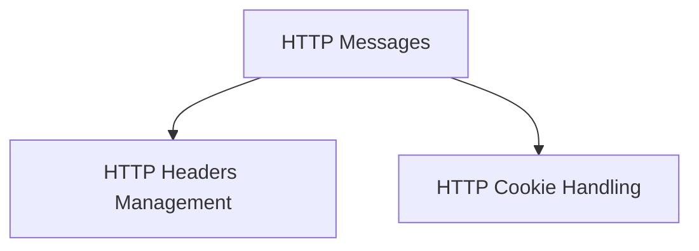

# Models Module Documentation

## Introduction

The `models` module in `httpx` defines the fundamental data structures used to represent HTTP requests and responses. It provides classes for managing HTTP headers, cookies, and the core request/response objects, ensuring consistency and ease of manipulation throughout the HTTP communication process.

## Architecture Overview

The `models` module is structured into several key components that work together to form the representation of HTTP messages. The core `Request` and `Response` objects encapsulate the details of an HTTP interaction, while `Headers` and `Cookies` manage specific aspects of these messages.

<!-- DIAGRAM_JSON
{
    "direction": "TD",
    "nodes": [
        {"id": "http_messages", "label": "HTTP Messages", "type": "module", "link": "http_messages.md"},
        {"id": "http_headers", "label": "HTTP Headers Management", "type": "module", "link": "http_headers.md"},
        {"id": "http_cookies", "label": "HTTP Cookie Handling", "type": "module", "link": "http_cookies.md"}
    ],
    "edges": [
        {"source": "http_messages", "target": "http_headers"},
        {"source": "http_messages", "target": "http_cookies"}
    ],
    "groups": []
}
-->

## Sub-modules and Core Functionality

Here's a breakdown of the sub-modules within `models` and their primary responsibilities:

*   ### [HTTP Messages](http_messages.md)
    This sub-module contains the `Request` and `Response` classes, which are the central objects for initiating HTTP requests and handling incoming HTTP responses. They manage the overall structure, content, and lifecycle of an HTTP exchange.

*   ### [HTTP Headers Management](http_headers.md)
    The `http_headers` sub-module provides the `Headers` class, a specialized dictionary-like object for storing and manipulating HTTP headers. It offers case-insensitive access and handles multiple header values efficiently.

*   ### [HTTP Cookie Handling](http_cookies.md)
    This sub-module is responsible for managing HTTP cookies. It includes the `Cookies` class, which interacts with `Request` and `Response` objects to extract, set, and delete cookies, along with compatibility classes for `urllib.request.Request` and `urllib.response.Response` to facilitate cookie jar operations.