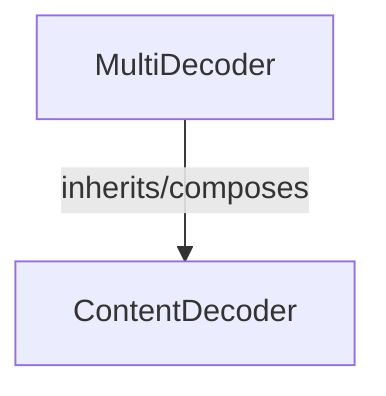

# multi_encoding_handler Module Documentation

## Introduction

The `multi_encoding_handler` module is a crucial component within the `decoders` package, specifically designed to manage scenarios where data has undergone multiple content encodings. It provides the `MultiDecoder` class, which orchestrates the decoding process by chaining together individual content decoders in the correct reverse order of their application.

## MultiDecoder Class

The `MultiDecoder` class is responsible for handling complex decoding requirements by aggregating multiple `ContentDecoder` instances. It ensures that data encoded with several layers of compression or transformation can be successfully restored to its original format.

### Purpose

To sequentially apply a series of `ContentDecoder` objects to data that has been encoded multiple times, effectively reversing the encoding process.

### Attributes

*   `children` (List[ContentDecoder]): A list of `ContentDecoder` instances, ordered in the reverse sequence of their original application, used for decoding the data.

### Methods

*   `__init__(self, children: typing.Sequence[ContentDecoder]) -> None`
    *   Initializes the `MultiDecoder` with a sequence of `ContentDecoder` objects. The provided `children` sequence is reversed internally to ensure that decoding occurs in the correct order.
    *   **Parameters**:
        *   `children`: A sequence of `ContentDecoder` objects representing the encodings applied to the data, from first to last.

*   `decode(self, data: bytes) -> bytes`
    *   Processes a chunk of encoded data by passing it through each child `ContentDecoder` in the reversed order.
    *   **Parameters**:
        *   `data`: A `bytes` object representing a chunk of encoded data.
    *   **Returns**:
        *   `bytes`: The partially or fully decoded data after processing by all child decoders.

*   `flush(self) -> bytes`
    *   Finalizes the decoding process, ensuring all buffered data from the child decoders is emitted. It calls `decode` with an empty byte string and then `flush` on each child decoder.
    *   **Returns**:
        *   `bytes`: Any remaining decoded data from the internal buffers of the child decoders.

## Architecture Diagram

<!-- DIAGRAM_JSON
{
    "direction": "TD",
    "nodes": [
        {"id": "multi_decoder", "label": "MultiDecoder", "type": "component", "link": null},
        {"id": "content_decoder_base", "label": "ContentDecoder", "type": "external", "link": "content_decoder_base.md"}
    ],
    "edges": [
        {"source": "multi_decoder", "target": "content_decoder_base", "label": "inherits/composes"}
    ],
    "groups": []
}
-->
