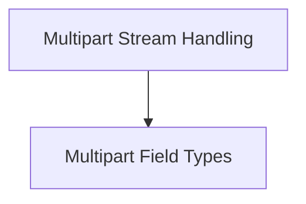

# Multipart Module

The `multipart` module in `httpx` is responsible for handling the encoding and decoding of multipart/form-data, a standard way to send data and files over HTTP. This is particularly useful for web forms that include file uploads.

## Architecture Overview

The `multipart` module is structured around the `MultipartStream`, which orchestrates the streaming of multipart encoded data, and individual field types (`DataField` and `FileField`) that represent the different parts of the multipart form data.

<!-- DIAGRAM_JSON
{
    "direction": "TD",
    "nodes": [
        {"id": "stream_handling", "label": "Multipart Stream Handling", "type": "module", "link": "stream_handling.md"},
        {"id": "field_types", "label": "Multipart Field Types", "type": "module", "link": "field_types.md"}
    ],
    "edges": [
        {"source": "stream_handling", "target": "field_types"}
    ],
    "groups": []
}
-->

## Sub-modules

### [Multipart Stream Handling](stream_handling.md)
This sub-module focuses on the `MultipartStream` class, which provides the core functionality for generating a byte stream of multipart encoded form data. It handles the overall structure, boundary generation, and content length calculation for the multipart request body.

### [Multipart Field Types](field_types.md)
This sub-module defines the different types of fields that can be included in a multipart form: `DataField` for simple key-value pairs and `FileField` for file uploads. It manages the rendering of headers and data for each individual field.
