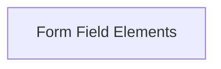

# Multipart Field Elements Documentation

The `multipart_field_elements` module is a crucial part of the `httpx._multipart` package, providing the fundamental building blocks for constructing multipart/form-data requests. It defines the structures for individual fields within a multipart form, distinguishing between file uploads and standard data fields.

## Architecture Overview

This module encapsulates the logic for handling the two primary types of form fields: `FileField` for file uploads and `DataField` for regular text or primitive data. These classes are responsible for correctly formatting the field headers, managing content types, and preparing the data for transmission within a multipart stream. They abstract away the complexities of MIME part formatting, ensuring that multipart requests are correctly structured according to HTTP specifications.

## Sub-modules

### Form Field Elements ([form_field_elements.md](form_field_elements.md))
This sub-module defines the structures for various types of fields used within multipart forms, including file and data fields. These classes manage how individual data parts are rendered and their associated headers.

<!-- DIAGRAM_JSON
{
    "direction": "TD",
    "nodes": [
        {"id": "form_field_elements", "label": "Form Field Elements", "type": "module", "link": "form_field_elements.md"}
    ],
    "edges": [],
    "groups": []
}
-->

