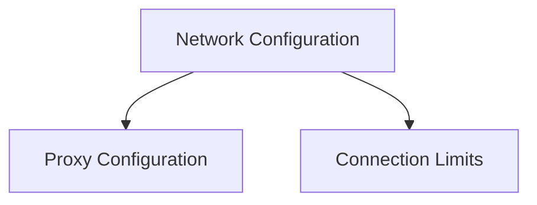

# Network Configuration Module

The `network_configuration` module, part of the `httpx._config` package, is responsible for defining and managing critical network-related settings for HTTP clients. It encompasses configurations for proxy servers and connection pooling, allowing users to fine-tune how HTTPX interacts with the network.

## Architecture Overview

The `network_configuration` module is logically divided into two primary sub-modules, each handling a specific aspect of network configuration:

<!-- DIAGRAM_JSON
{
    "direction": "TD",
    "nodes": [
        {"id": "proxy_configuration", "label": "Proxy Configuration", "type": "module", "link": "proxy_configuration.md"},
        {"id": "connection_limits", "label": "Connection Limits", "type": "module", "link": "connection_limits.md"}
    ],
    "edges": [
        {"source": "network_configuration", "target": "proxy_configuration"},
        {"source": "network_configuration", "target": "connection_limits"}
    ],
    "groups": [
        {"id": "network_configuration", "label": "Network Configuration", "nodes": ["proxy_configuration", "connection_limits"]}
    ]
}
-->

## Sub-modules and Functionality

This module comprises the following sub-modules, each dedicated to a distinct area of network configuration:

*   **[Proxy Configuration](proxy_configuration.md)**: This sub-module (represented by `httpx._config.Proxy`) handles all aspects of configuring and managing proxy servers. It allows clients to specify proxy URLs, authentication credentials, and custom headers for proxy interactions.

*   **[Connection Limits](connection_limits.md)**: This sub-module (represented by `httpx._config.Limits`) defines and enforces limits on the client's network connections. It provides controls over the maximum number of concurrent connections, maximum keep-alive connections, and the expiry time for idle keep-alive connections.

## Integration with the Overall System

The `network_configuration` module is a fundamental part of the `httpx` client's initialization and request lifecycle. The settings defined here are consumed by the HTTPX client to manage underlying transport layers, establish connections, and route requests through proxies if configured. It works in conjunction with other configuration modules like [timeout_settings.md](timeout_settings.md) and the broader [client.md](client.md) module to provide a comprehensive and flexible networking solution.