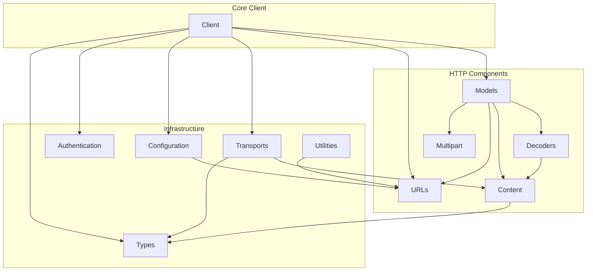

## httpx Repository Overview

### Purpose of the Repository

`httpx` is a comprehensive HTTP client for Python 3, offering both synchronous and asynchronous APIs. It provides a robust and extensible framework for handling all aspects of HTTP communication, including making requests, processing responses, managing various authentication schemes, configuring client behavior (such as timeouts and proxies), representing HTTP messages (requests, responses, headers, and cookies), efficiently streaming and decoding content, parsing and manipulating URLs, and abstracting the underlying network communication through flexible transport layers.

### Architecture Diagram

The following diagram illustrates the main modules of the `httpx` repository and their primary relationships:

