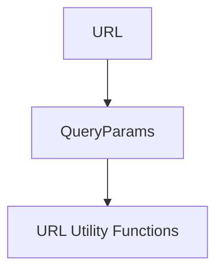

# Query Parameters Module

## Introduction

The `query_parameters` module, specifically the `QueryParams` class, provides a robust and immutable abstraction for handling URL query strings within the `httpx` library. It treats query parameters as a multi-dict, allowing for multiple values associated with a single key, which is crucial for accurately representing complex URL structures.

## Core Functionality: `QueryParams`

The `QueryParams` class is designed to parse, manipulate, and serialize URL query parameters. It ensures immutability for safe and predictable operations, with all modification methods returning new `QueryParams` instances rather than altering the original.

### Initialization

`QueryParams` can be initialized from various input types, including:
-   A URL query string (e.g., `"a=123&a=456&b=789"`)
-   A dictionary (e.g., `{"a": "123", "b": ["456", "789"]}`)
-   A list of key-value tuples (e.g., `[("a", "123"), ("a", "456"), ("b", "789")]`)
-   Another `QueryParams` instance

All keys and values are internally coerced to strings, with special handling for `True`, `False`, and `None` to produce `"true"`, `"false"`, and `""` respectively.

### Key Methods and Properties

`QueryParams` provides a comprehensive set of methods for interacting with query parameters:

*   **`keys()`**: Returns a view of all unique keys in the query parameters.
*   **`values()`**: Returns a view of the first value for each unique key.
*   **`items()`**: Returns a view of the first key-value pair for each unique key.
*   **`multi_items()`**: Returns a list of all key-value pairs, including duplicates for keys that appear multiple times in the query string. This is essential for preserving the original structure of multi-valued parameters.
*   **`get(key, default=None)`**: Retrieves the first value associated with a given `key` or a `default` if the key is not found.
*   **`get_list(key)`**: Retrieves all values associated with a given `key` as a list.
*   **`set(key, value)`**: Returns a *new* `QueryParams` instance with the specified `key` set to the given `value`. This overwrites any existing values for that key.
*   **`add(key, value)`**: Returns a *new* `QueryParams` instance with the specified `value` appended to the existing values for `key`. If the key doesn't exist, it's added.
*   **`remove(key)`**: Returns a *new* `QueryParams` instance with the specified `key` and its associated values removed.
*   **`merge(params)`**: Returns a *new* `QueryParams` instance, merging the current parameters with another set of `params`. Keys from the merged `params` will override existing keys.
*   **`__str__()`**: Provides a URL-encoded string representation of the query parameters.
*   **`__repr__()`**: Provides a string representation for debugging, showing the class name and the URL-encoded query string.

### Immutability

As of `httpx` 0.18.0, `QueryParams` instances are immutable. Attempting to directly modify an instance using `update()` or `__setitem__` will raise a `RuntimeError`. Instead, methods like `set()`, `add()`, `remove()`, and `merge()` must be used, which return new `QueryParams` instances with the desired modifications.

## Architecture and Component Relationships

The `QueryParams` class is a fundamental component within the `urls` module, responsible for the specific task of handling URL query strings. It works in conjunction with other components within the `urls` module, particularly the `URL` class, to construct and deconstruct complete URLs.

<!-- DIAGRAM_JSON
{
    "direction": "TD",
    "nodes": [
        {"id": "query_params", "label": "QueryParams", "type": "component", "link": null},
        {"id": "url", "label": "URL", "type": "external", "link": "url_parsing_and_manipulation.md"},
        {"id": "url_utils", "label": "URL Utility Functions", "type": "component", "link": null}
    ],
    "edges": [
        {"source": "query_params", "target": "url_utils"},
        {"source": "url", "target": "query_params"}
    ],
    "groups": []
}
-->

## Integration with the Overall System

The `query_parameters` module, through its `QueryParams` class, plays a vital role in `httpx`'s URL handling capabilities. It is primarily utilized by the [url_parsing_and_manipulation.md](url_parsing_and_manipulation.md) module's `URL` class to manage the query string portion of a URL. When constructing or parsing URLs, `QueryParams` ensures that query parameters are correctly handled, including multi-valued parameters and proper URL encoding/decoding. This allows `httpx` to accurately form requests and interpret responses with complex query strings.

By providing a dedicated and immutable object for query parameters, the module enhances the robustness and predictability of URL manipulation throughout the `httpx` library, ensuring consistent behavior across various HTTP operations.
