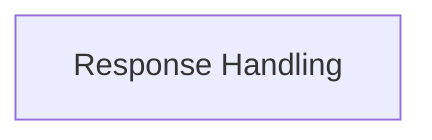

# Response Handling

Manages HTTP responses, including status codes, headers, content decoding, and streaming.

## Components

This module contains 1 component(s):

- `httpx._models.Response`

## Structure

---
*This documentation was auto-generated to ensure completeness.*
