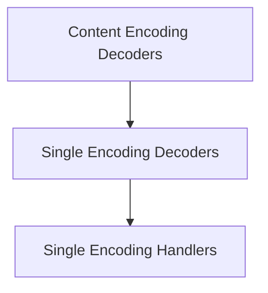

# single_encoding_decoders Module

## Introduction

The `single_encoding_decoders` module is a crucial component within the `httpx._decoders` package, specifically designed to handle the decoding of content that uses a single, well-defined encoding. It provides a set of specialized decoders capable of processing various standard compression and encoding formats, ensuring that received data can be correctly interpreted and utilized by the application. This module abstracts away the complexities of different decoding algorithms, offering a unified interface for content integrity.

## Architecture

The `single_encoding_decoders` module is a child of the `content_encoding_decoders` module, which itself is part of the broader `decoders` module. It primarily comprises the `single_encoding_handlers` sub-module, which encapsulates the individual decoding implementations.

<!-- DIAGRAM_JSON
{
    "direction": "TD",
    "nodes": [
        {"id": "single_encoding_decoders", "label": "Single Encoding Decoders", "type": "module", "link": "single_encoding_decoders.md"},
        {"id": "content_encoding_decoders", "label": "Content Encoding Decoders", "type": "module", "link": "content_encoding_decoders.md"},
        {"id": "single_encoding_handlers", "label": "Single Encoding Handlers", "type": "module", "link": "single_encoding_handlers.md"}
    ],
    "edges": [
        {"source": "content_encoding_decoders", "target": "single_encoding_decoders"},
        {"source": "single_encoding_decoders", "target": "single_encoding_handlers"}
    ],
    "groups": []
}
-->

## Sub-modules

### [Single Encoding Handlers](single_encoding_handlers.md)

This sub-module provides the core functionality for decoding various single content encodings. It includes specific implementations for handling `identity` (unencoded data), `deflate`, `brotli`, `zstandard`, and `gzip` compressed content. Each handler is designed to process its respective encoding efficiently, ensuring correct data decompression and integrity.
