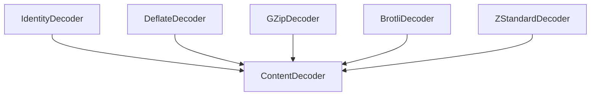

# `single_encoding_handlers` Module Documentation

The `single_encoding_handlers` module provides concrete implementations for decoding various single content encodings within the `httpx` library. These handlers are essential for processing HTTP responses that use standard compression or encoding schemes, ensuring that the received data can be correctly decompressed and interpreted.

## Core Functionality

This module contains individual decoder classes, each responsible for a specific content encoding. All decoders inherit from the `ContentDecoder` base class, providing a consistent interface for decoding data streams. The primary functionalities include:

*   **Identity Decoding**: Handling unencoded data, returning it as-is.
*   **Deflate Decoding**: Decompressing data encoded with the Deflate algorithm.
*   **GZip Decoding**: Decompressing data encoded with the GZip algorithm.
*   **Brotli Decoding**: Decompressing data encoded with the Brotli algorithm (requires `brotli` or `brotlipy`).
*   **ZStandard Decoding**: Decompressing data encoded with the ZStandard algorithm (requires `zstandard`).

These decoders are crucial for the `httpx` client to automatically handle and decompress response bodies based on the `Content-Encoding` header, making data transparently accessible to the application.

## Architecture and Component Relationships

The `single_encoding_handlers` module is a leaf module within the `decoders` sub-system. It houses the specific implementations for handling different single content encodings. Each decoder is a specialized component that conforms to the `ContentDecoder` interface defined in the [content_decoder_base module](content_decoder_base.md).

<!-- DIAGRAM_JSON
{
    "direction": "TD",
    "nodes": [
        {"id": "identity_decoder", "label": "IdentityDecoder", "type": "component", "link": null},
        {"id": "deflate_decoder", "label": "DeflateDecoder", "type": "component", "link": null},
        {"id": "gzip_decoder", "label": "GZipDecoder", "type": "component", "link": null},
        {"id": "brotli_decoder", "label": "BrotliDecoder", "type": "component", "link": null},
        {"id": "zstandard_decoder", "label": "ZStandardDecoder", "type": "component", "link": null},
        {"id": "content_decoder", "label": "ContentDecoder", "type": "external", "link": "content_decoder_base.md"}
    ],
    "edges": [
        {"source": "identity_decoder", "target": "content_decoder"},
        {"source": "deflate_decoder", "target": "content_decoder"},
        {"source": "gzip_decoder", "target": "content_decoder"},
        {"source": "brotli_decoder", "target": "content_decoder"},
        {"source": "zstandard_decoder", "target": "content_decoder"}
    ],
    "groups": []
}
-->

## Module Components

### `IdentityDecoder`

Handles cases where data is unencoded. It simply returns the input data as is.

*   `decode(data: bytes) -> bytes`: Returns the `data` unchanged.
*   `flush() -> bytes`: Returns an empty bytes object.

### `DeflateDecoder`

Decodes data compressed using the Deflate algorithm, often encountered in HTTP `Content-Encoding` headers. It uses Python's `zlib` module for decompression.

*   `__init__()`: Initializes the `zlib.decompressobj`.
*   `decode(data: bytes) -> bytes`: Decompresses a chunk of data. Includes logic to handle initial decompression attempts which might require a different `zlib` window size.
*   `flush() -> bytes`: Flushes any remaining decompressed data.

### `GZipDecoder`

Decodes data compressed using the GZip algorithm. Similar to `DeflateDecoder`, it utilizes Python's `zlib` module, but with a specific window size to handle GZip headers.

*   `__init__()`: Initializes the `zlib.decompressobj` with `zlib.MAX_WBITS | 16` for GZip.
*   `decode(data: bytes) -> bytes`: Decompresses a chunk of GZip encoded data.
*   `flush() -> bytes`: Flushes any remaining decompressed data.

### `BrotliDecoder`

Handles decompression of data encoded with the Brotli algorithm. This decoder dynamically supports both `brotlipy` and `Brotli` packages, requiring one of them to be installed (`pip install httpx[brotli]`).

*   `__init__()`: Checks for `brotli` package availability and initializes the `brotli.Decompressor`.
*   `decode(data: bytes) -> bytes`: Decompresses a chunk of Brotli encoded data.
*   `flush() -> bytes`: Flushes any remaining decompressed data, potentially checking for stream integrity in `brotlipy`.

### `ZStandardDecoder`

Decodes data compressed using the ZStandard (Zstd) algorithm, as specified by RFC 8878. This decoder requires the `zstandard` package to be installed (`pip install httpx[zstd]`).

*   `__init__()`: Checks for `zstandard` package availability and initializes `zstandard.ZstdDecompressor().decompressobj()`.
*   `decode(data: bytes) -> bytes`: Decompresses a chunk of ZStandard encoded data, handling potential multiple frames and unused data.
*   `flush() -> bytes`: Flushes any remaining decompressed data and raises an error if the ZStandard data is incomplete.

## How it Fits into the Overall System

These single encoding handlers are fundamental building blocks for the `httpx` content decoding mechanism. They are leveraged by higher-level decoders, specifically the [content_encoding_decoders module](content_encoding_decoders.md) and its sub-module, the [multi_encoding_handler module](multi_encoding_handler.md).

The `content_encoding_decoders` module uses these individual decoders to create a chain of decompression when multiple `Content-Encoding` headers are present (e.g., `gzip, deflate`). The `multi_encoding_handler` specifically orchestrates the application of multiple decoders in the correct order.

By centralizing these decoding responsibilities, `httpx` can efficiently and reliably handle a wide range of compressed HTTP responses, providing a seamless experience for developers by automatically decompressing response bodies.