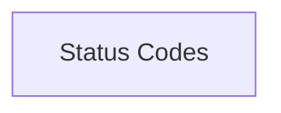

# Status Codes

Documentation for the Status Codes module.

## Components

This module contains 1 component(s):

- `httpx._status_codes.codes`

## Structure

---
*This documentation was auto-generated to ensure completeness.*
