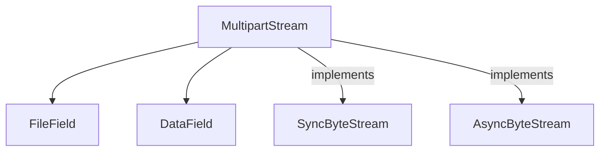

# stream_handling Module Documentation

The `stream_handling` module is responsible for efficiently preparing and handling streaming `multipart/form-data` for HTTP requests. It provides the `MultipartStream` class, which allows for robust encoding of form data and file uploads, enabling non-blocking and memory-efficient content transfer.

<!-- DIAGRAM_JSON
{
    "direction": "TD",
    "nodes": [
        {"id": "multipart_stream", "label": "MultipartStream", "type": "component", "link": null},
        {"id": "file_field", "label": "FileField", "type": "external", "link": "field_types.md"},
        {"id": "data_field", "label": "DataField", "type": "external", "link": "field_types.md"},
        {"id": "sync_byte_stream", "label": "SyncByteStream", "type": "external", "link": "types.md"},
        {"id": "async_byte_stream", "label": "AsyncByteStream", "type": "external", "link": "types.md"}
    ],
    "edges": [
        {"source": "multipart_stream", "target": "file_field"},
        {"source": "multipart_stream", "target": "data_field"},
        {"source": "multipart_stream", "target": "sync_byte_stream", "label": "implements"},
        {"source": "multipart_stream", "target": "async_byte_stream", "label": "implements"}
    ],
    "groups": []
}
-->

## 1. Module Purpose and Core Functionality

The `stream_handling` module's primary function is to serialize and stream `multipart/form-data` content. This is particularly useful for HTTP requests involving file uploads and complex form submissions where the request body needs to be generated on the fly without loading the entire content into memory.

### 1.1 `MultipartStream` Class

The `MultipartStream` class is the central component of this module, designed to create a byte stream for `multipart/form-data` content. It adheres to both synchronous (`SyncByteStream`) and asynchronous (`AsyncByteStream`) streaming interfaces, making it versatile for different I/O patterns.

**Core Features:**

*   **Initialization:** Takes `RequestData` (form fields) and `RequestFiles` (file-like objects) as input. It automatically generates a unique boundary string if not provided.
*   **Field Processing (`_iter_fields`):** Iterates through the provided data and files, converting them into `DataField` and `FileField` objects, which are handled by the [field_types module](field_types.md). This abstraction allows `MultipartStream` to focus on the overall structure while delegating individual field rendering.
*   **Chunk Iteration (`iter_chunks`):** Generates the multipart content in chunks, including the boundary strings and the rendered content of each field. This method is the heart of its streaming capability.
*   **Content Length Calculation (`get_content_length`):** Attempts to calculate the total length of the multipart content. If any component (like an unknown-length file stream) prevents this, it returns `None`, signaling that `Transfer-Encoding: chunked` should be used.
*   **Header Generation (`get_headers`):** Produces the necessary HTTP headers, specifically `Content-Type` (with the boundary) and either `Content-Length` (if known) or `Transfer-Encoding: chunked`.
*   **Stream Interfaces (`__iter__`, `__aiter__`):** Implements both `__iter__` for synchronous iteration and `__aiter__` for asynchronous iteration, delegating to `iter_chunks` to provide the actual byte streams. This fulfills the requirements of the [types module](types.md) for `SyncByteStream` and `AsyncByteStream`.

## 2. Architecture and Component Relationships

The `stream_handling` module, via `MultipartStream`, acts as an orchestrator for creating multipart content.

*   **Internal Components:** The primary internal component is `MultipartStream` itself, which manages the overall multipart structure.
*   **Dependencies on `field_types`:** `MultipartStream` heavily relies on the `FileField` and `DataField` classes from the [field_types module](field_types.md) to represent and render individual parts of the multipart message. It delegates the responsibility of content rendering for each field to these external components.
*   **Dependencies on `types`:** `MultipartStream` implements the `SyncByteStream` and `AsyncByteStream` interfaces defined in the [types module](types.md). This ensures that `MultipartStream` can be used interchangeably wherever a byte stream is expected, either synchronously or asynchronously, within the HTTPX library.

## 3. How the Module Fits into the Overall System

The `stream_handling` module plays a critical role in the `httpx` library's ability to send complex request bodies efficiently.

*   **Request Preparation:** When an HTTP client (e.g., `httpx._client.Client` or `httpx._client.AsyncClient` from the [client module](client.md)) needs to send data using `multipart/form-data` (typically with `files` or complex `data` arguments), it instantiates `MultipartStream`.
*   **Content Provider:** `MultipartStream` then acts as the content provider for the HTTP request, delivering the body data in chunks to the underlying transport layer.
*   **Efficiency:** By streaming the content, `stream_handling` avoids loading large files or extensive form data entirely into memory before sending, which is crucial for performance and memory management in web applications.
