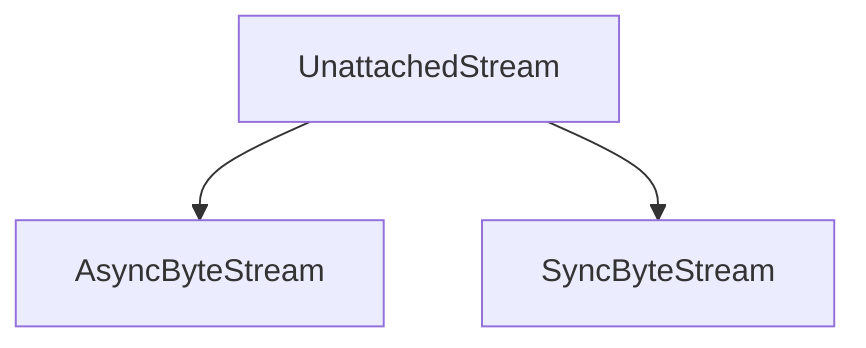

# `stream_state_management` Module Documentation

## Introduction

The `stream_state_management` module, a sub-module of `content`, is responsible for defining the state and behavior of a stream that is no longer actively attached for I/O operations. Its primary component, `UnattachedStream`, ensures that attempts to read from a serialized or disconnected stream correctly raise an error, preventing unexpected behavior.

## Purpose and Core Functionality

This module addresses scenarios where a request or response object, particularly one containing a stream, has been serialized (e.g., using `pickle`). After serialization, the underlying I/O stream might no longer be available or valid. The `UnattachedStream` class provides a clear mechanism to handle this "unattached" state.

Core functionalities include:

*   **Stream State Management**: Defines a state for streams that are not connected for active I/O.
*   **Error Handling**: Raises a `StreamClosed` error when any attempt is made to iterate (synchronously or asynchronously) over an `UnattachedStream`, ensuring that developers are immediately aware that the stream is not available for reading.
*   **Serialization Safety**: Contributes to the robustness of `httpx` by providing a defined behavior for streams that have undergone serialization.

## Architecture and Component Relationships

The `stream_state_management` module is a leaf module within the `content` module, focusing on a specific aspect of stream handling. Its main component, `UnattachedStream`, implements both `AsyncByteStream` and `SyncByteStream` interfaces, indicating its role in fulfilling the byte stream contract while explicitly managing its disconnected state.

<!-- DIAGRAM_JSON
{
    "direction": "TD",
    "nodes": [
        {"id": "unattached_stream", "label": "UnattachedStream", "type": "component", "link": null},
        {"id": "async_byte_stream", "label": "AsyncByteStream", "type": "external", "link": "types.md"},
        {"id": "sync_byte_stream", "label": "SyncByteStream", "type": "external", "link": "types.md"}
    ],
    "edges": [
        {"source": "unattached_stream", "target": "async_byte_stream"},
        {"source": "unattached_stream", "target": "sync_byte_stream"}
    ],
    "groups": []
}
-->



### Core Components

#### `httpx._content.UnattachedStream`

This class represents a stream that is no longer attached to its original I/O source, typically due to serialization. It implements both `AsyncByteStream` and `SyncByteStream` from the [types module](types.md). Any attempt to read from this stream (via `__iter__` or `__aiter__`) will raise a `StreamClosed` exception.

**Code Snippet:**

```python
class UnattachedStream(AsyncByteStream, SyncByteStream):
    """
    If a request or response is serialized using pickle, then it is no longer
    attached to a stream for I/O purposes. Any stream operations should result
    in `httpx.StreamClosed`.
    """

    def __iter__(self) -> Iterator[bytes]:
        raise StreamClosed()

    async def __aiter__(self) -> AsyncIterator[bytes]:
        raise StreamClosed()
        yield b""  # pragma: no cover
```

## How it Fits into the Overall System

The `stream_state_management` module plays a crucial role in maintaining data integrity and predictability within `httpx`, especially when dealing with request and response objects that might be serialized or passed across different contexts. By explicitly defining the `UnattachedStream` state, it prevents silent failures or undefined behavior when a stream's underlying I/O connection is no longer available. This ensures that stream operations always reflect the current, valid state of the stream, contributing to the robustness and reliability of the `httpx` library.