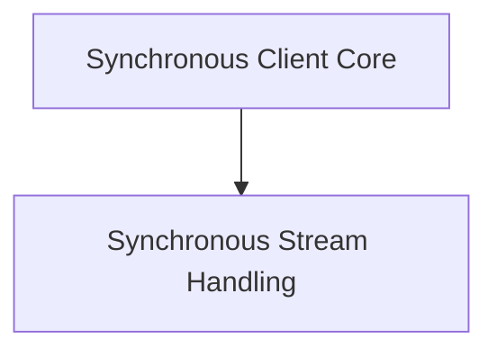

# sync_client Module Documentation

The `sync_client` module provides the synchronous HTTP client functionalities for the httpx library. It offers a robust way to make HTTP requests, handle responses, and manage connections in a blocking manner.

## Architecture Overview

The `sync_client` module is composed of two primary sub-modules:

*   **[Synchronous Client Core](sync_client_core.md)**: Encapsulates the main client logic for building and sending requests.
*   **[Synchronous Stream Handling](sync_stream_handler.md)**: Manages the synchronous streaming of response data.

The `sync_client_core` heavily relies on the `sync_stream_handler` for processing streamed responses.

<!-- DIAGRAM_JSON
{
    "direction": "TD",
    "nodes": [
        {"id": "sync_client_core", "label": "Synchronous Client Core", "type": "module", "link": "sync_client_core.md"},
        {"id": "sync_stream_handler", "label": "Synchronous Stream Handling", "type": "module", "link": "sync_stream_handler.md"}
    ],
    "edges": [
        {"source": "sync_client_core", "target": "sync_stream_handler"}
    ],
    "groups": []
}
-->

## Sub-modules

### [Synchronous Client Core](sync_client_core.md)

This sub-module, defined by the `httpx._client.Client` component, is the central point for synchronous HTTP communication. It handles request creation, sending, and manages various client-level configurations such as authentication, headers, cookies, and redirects.

### [Synchronous Stream Handling](sync_stream_handler.md)

This sub-module, built around the `httpx._client.BoundSyncStream` component, is responsible for efficiently handling streamed responses in a synchronous context. It ensures that response data can be processed in chunks and manages the closure of the stream, setting the elapsed time for the response.