# `sync_client_core` Module Documentation

## Introduction

The `sync_client_core` module is a fundamental part of the `httpx` library, specifically designed for handling synchronous HTTP communication. Its primary component, `httpx._client.Client`, provides a comprehensive interface for making HTTP requests with advanced features such as connection pooling, HTTP/2 support, automatic redirects, and cookie persistence.

## Module Purpose and Core Functionality

The `sync_client_core` module encapsulates the `Client` class, which serves as the main entry point for synchronous HTTP requests. It simplifies the process of interacting with web services by abstracting away the complexities of network communication, connection management, and protocol handling.

### `httpx._client.Client`

The `Client` class is a robust HTTP client offering:

*   **Connection Pooling**: Efficiently reuses network connections, reducing latency for subsequent requests to the same host.
*   **HTTP/1.1 and HTTP/2 Support**: Configurable to use either HTTP/1.1 or HTTP/2 protocols.
*   **Authentication**: Supports various authentication schemes through integration with the [authentication](authentication.md) module.
*   **Redirect Handling**: Automatically follows HTTP redirects up to a configurable maximum.
*   **Cookie Persistence**: Manages cookies across requests, maintaining session state.
*   **Timeouts and Limits**: Allows granular control over request timeouts and connection limits.
*   **Proxies**: Supports routing requests through HTTP or SOCKS proxies.
*   **Request and Response Streaming**: Provides options for streaming request bodies and response content, ideal for large data transfers.
*   **Event Hooks**: Enables custom logic execution at different stages of the request-response lifecycle.

**Key Methods:**

*   `__init__`: Initializes the client with various configurations, including authentication, headers, cookies, timeouts, limits, and transport settings.
*   `request(method, url, ...) `: The central method for building and sending a synchronous HTTP request. It integrates client-level configurations with per-request parameters.
*   `stream(method, url, ...) `: Returns a context manager for handling streaming responses, allowing iterative processing of the response body.
*   `send(request, ...) `: Sends an already constructed `Request` object, handling authentication and redirects internally.
*   `_send_single_request(request)`: Handles the actual sending of a single HTTP request using the configured transport.
*   `get()`, `post()`, `put()`, `delete()`, `head()`, `options()`, `patch()`: Convenience methods for common HTTP verbs, all internally calling the `request` method.
*   `close()`: Closes the underlying transport connections and releases resources.

## Architecture and Component Relationships

The `Client` class in `sync_client_core` builds upon `BaseClient` from the [client_base](client_base.md) module and orchestrates interactions with several other modules to deliver its full functionality.

<!-- DIAGRAM_JSON
{
    "direction": "TD",
    "nodes": [
        {"id": "client_component", "label": "Client", "type": "component", "link": null},
        {"id": "base_client", "label": "BaseClient", "type": "external", "link": "client_base.md"},
        {"id": "http_transport", "label": "HTTPTransport", "type": "external", "link": "transports.md"},
        {"id": "auth_module", "label": "Auth", "type": "external", "link": "authentication.md"},
        {"id": "models_module", "label": "Request, Response, Cookies", "type": "external", "link": "models.md"},
        {"id": "urls_module", "label": "URL, QueryParams", "type": "external", "link": "urls.md"},
        {"id": "utilities_module", "label": "URLPattern", "type": "external", "link": "utilities.md"},
        {"id": "configuration_module", "label": "Timeout, Limits, Proxy", "type": "external", "link": "configuration.md"},
        {"id": "types_module", "label": "SyncByteStream", "type": "external", "link": "types.md"},
        {"id": "sync_stream_handler_module", "label": "BoundSyncStream", "type": "external", "link": "sync_stream_handler.md"},
        {"id": "use_client_default", "label": "UseClientDefault", "type": "external", "link": "client_base.md"},
        {"id": "client_state", "label": "ClientState", "type": "external", "link": "client_base.md"}
    ],
    "edges": [
        {"source": "client_component", "target": "base_client", "label": "inherits from"},
        {"source": "client_component", "target": "http_transport", "label": "uses"},
        {"source": "client_component", "target": "auth_module", "label": "uses for auth flow"},
        {"source": "client_component", "target": "models_module", "label": "handles"},
        {"source": "client_component", "target": "urls_module", "label": "processes"},
        {"source": "client_component", "target": "utilities_module", "label": "uses"},
        {"source": "client_component", "target": "configuration_module", "label": "configures with"},
        {"source": "client_component", "target": "types_module", "label": "manages streams"},
        {"source": "client_component", "target": "sync_stream_handler_module", "label": "wraps streams"},
        {"source": "client_component", "target": "use_client_default", "label": "uses default sentinel"},
        {"source": "client_component", "target": "client_state", "label": "manages state"}
    ],
    "groups": []
}
-->

```mermaid
graph TD
    client_component[Client]
    base_client[BaseClient]
    http_transport[HTTPTransport]
    auth_module[Auth]
    models_module[Request, Response, Cookies]
    urls_module[URL, QueryParams]
    utilities_module[URLPattern]
    configuration_module[Timeout, Limits, Proxy]
    types_module[SyncByteStream]
    sync_stream_handler_module[BoundSyncStream]
    use_client_default[UseClientDefault]
    client_state[ClientState]

    client_component -- "inherits from" --> base_client
    client_component -- "uses" --> http_transport
    client_component -- "uses for auth flow" --> auth_module
    client_component -- "handles" --> models_module
    client_component -- "processes" --> urls_module
    client_component -- "uses" --> utilities_module
    client_component -- "configures with" --> configuration_module
    client_component -- "manages streams" --> types_module
    client_component -- "wraps streams" --> sync_stream_handler_module
    client_component -- "uses default sentinel" --> use_client_default
    client_component -- "manages state" --> client_state
```

## How the Module Fits into the Overall System

The `sync_client_core` module, through its `Client` class, is the cornerstone for all synchronous HTTP operations within the `httpx` library. It acts as a high-level facade that orchestrates various low-level functionalities provided by other modules.

*   It inherits core client behaviors and state management from [client_base](client_base.md).
*   It relies on the [transports](transports.md) module (specifically `HTTPTransport`) for the actual network communication.
*   Authentication mechanisms are delegated to the [authentication](authentication.md) module.
*   Request and response structures are defined and managed by the [models](models.md) module.
*   URL parsing and manipulation are handled by the [urls](urls.md) and [utilities](utilities.md) modules.
*   Configuration aspects like timeouts, limits, and proxy settings are provided by the [configuration](configuration.md) module.
*   Stream handling for synchronous operations is facilitated by the [types](types.md) module (`SyncByteStream`) and wrapped by [sync_stream_handler](sync_stream_handler.md) (`BoundSyncStream`).

Essentially, `sync_client_core` provides a unified, synchronous interface for developers, integrating capabilities from across the `httpx` ecosystem to offer a powerful and flexible HTTP client.