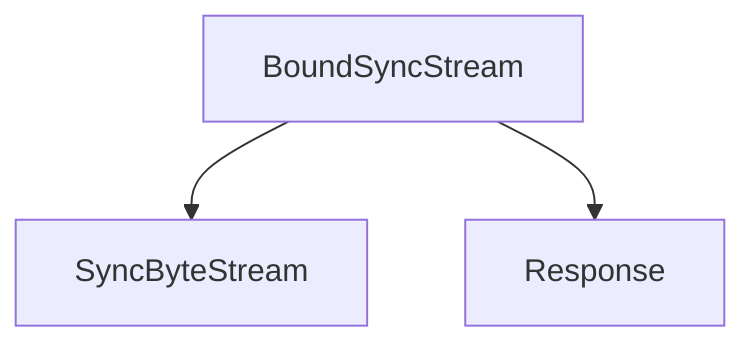

# `sync_stream_handler` Module Documentation

## Introduction

The `sync_stream_handler` module is a core component within the `httpx` client library, specifically designed to manage synchronous byte streams associated with HTTP responses. Its primary function is to wrap an underlying byte stream, allowing for precise measurement of the time elapsed during the consumption and closure of the response stream. This module ensures that response timing information, crucial for performance monitoring and debugging, is accurately captured.

## Architecture and Component Relationships

The `sync_stream_handler` module contains the `BoundSyncStream` class, which is responsible for the synchronous handling of response streams and the calculation of their elapsed time.

<!-- DIAGRAM_JSON
{
    "direction": "TD",
    "nodes": [
        {"id": "bound_sync_stream", "label": "BoundSyncStream", "type": "component", "link": null},
        {"id": "sync_byte_stream", "label": "SyncByteStream", "type": "external", "link": "types.md"},
        {"id": "response_model", "label": "Response", "type": "external", "link": "models.md"}
    ],
    "edges": [
        {"source": "bound_sync_stream", "target": "sync_byte_stream"},
        {"source": "bound_sync_stream", "target": "response_model"}
    ],
    "groups": []
}
-->

### Core Components

#### `BoundSyncStream`

The `BoundSyncStream` class extends `SyncByteStream` and acts as a wrapper around an actual synchronous byte stream. It tracks the start time of the stream's processing and, upon closure, calculates the total elapsed time, which is then assigned to the `response.elapsed` attribute. This mechanism is vital for profiling and understanding the latency associated with receiving and processing response bodies.

-   **`__init__(self, stream: SyncByteStream, response: Response, start: float) -> None`**: Initializes the `BoundSyncStream` with the actual byte stream, the `Response` object it's associated with, and the starting timestamp.
-   **`__iter__(self) -> typing.Iterator[bytes]`**: Allows iteration over the underlying stream's chunks, providing the raw byte content.
-   **`close(self) -> None`**: Closes the underlying stream and calculates the `elapsed` time, updating the `response.elapsed` attribute.

### Dependencies

-   **`types` module**: The `BoundSyncStream` class inherits from `SyncByteStream`, which is defined in the [types](types.md) module, representing a generic synchronous byte stream interface.
-   **`models` module**: The `BoundSyncStream` operates in conjunction with the `Response` object, which is defined in the [models](models.md) module. It specifically updates the `elapsed` attribute of this `Response` instance.

## How the Module Fits into the Overall System

The `sync_stream_handler` module, through its `BoundSyncStream` component, is an integral part of the synchronous client's response processing pipeline. It is a child module of `sync_client`, which in turn is part of the broader `client` module. When a synchronous HTTP request is made and a response is received, the `sync_client` utilizes `BoundSyncStream` to manage the flow of the response body. This ensures that stream-related operations, particularly the timing of stream consumption, are handled consistently and accurately within the `httpx` synchronous client architecture.

It plays a critical role in providing comprehensive timing metrics for network operations, allowing developers to gain insights into the performance characteristics of their HTTP requests and responses.
