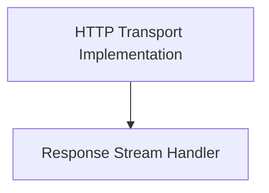

# Sync Transports Module Documentation

## Introduction

The `sync_transports` module in `httpx` provides the core synchronous HTTP transport mechanisms. It is responsible for handling synchronous HTTP requests, managing connections, applying various configurations like proxies and SSL contexts, and processing HTTP responses. This module is a fundamental part of `httpx` for making blocking network requests.

## Architecture Overview

The `sync_transports` module is composed of two primary sub-modules:
- `http_transport_implementation`: Manages the actual HTTP connection and request/response cycle.
- `response_stream_handler`: Facilitates the streaming of HTTP responses in a synchronous manner.

These components work together to provide a robust and configurable synchronous HTTP client experience.

<!-- DIAGRAM_JSON
{
    "direction": "TD",
    "nodes": [
        {"id": "http_transport_implementation", "label": "HTTP Transport Implementation", "type": "module", "link": "http_transport_implementation.md"},
        {"id": "response_stream_handler", "label": "Response Stream Handler", "type": "module", "link": "response_stream_handler.md"}
    ],
    "edges": [
        {"source": "http_transport_implementation", "target": "response_stream_handler"}
    ],
    "groups": []
}
-->

## Sub-modules

### [HTTP Transport Implementation](http_transport_implementation.md)
This sub-module, primarily through the `HTTPTransport` class, is responsible for the actual execution of synchronous HTTP requests. It handles the low-level details of establishing connections, managing connection pools, configuring proxies (HTTP, HTTPS, SOCKS), applying SSL contexts, and managing retry logic. It acts as an interface to the `httpcore` library for performing the core network operations.

### [Response Stream Handler](response_stream_handler.md)
This sub-module, represented by the `ResponseStream` class, provides a synchronous byte stream abstraction for the data received in an HTTP response. It wraps the underlying `httpcore` response stream, allowing iterative consumption of the response body and proper resource cleanup upon closing the stream. This ensures efficient and manageable handling of potentially large response payloads.