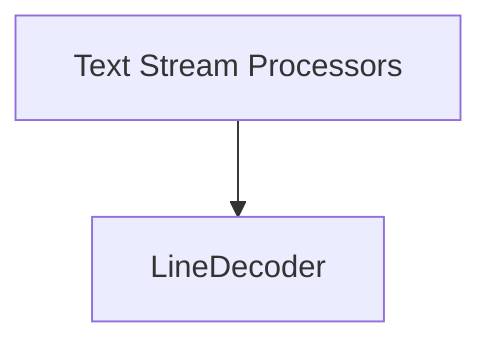

# text_line_decoding Module Documentation

## Introduction

The `text_line_decoding` module provides robust functionality for incrementally decoding a stream of text into individual lines. It addresses the complexities of handling line breaks (`
`, `\r`, `\r
`, and other unicode newline characters) across arbitrary chunks of data, ensuring accurate and efficient line-by-line processing.

This module is a crucial component within the larger `decoders` package, specifically serving the `text_stream_processors` for handling text-based data streams.

## Core Functionality

The primary component of this module is the `LineDecoder` class, which is designed to mimic the behavior of Python's built-in `str.splitlines()` method but adapted for iterative input. This allows for processing text streams where the input is received in chunks, and a single line might span across multiple such chunks.

### `LineDecoder` Class

The `LineDecoder` class maintains an internal buffer to store partial lines that have not yet been terminated by a newline character. It intelligently handles various newline conventions, including trailing carriage returns (`\r`), to ensure that lines are correctly assembled and returned only when complete.

Key features of `LineDecoder`:
-   **Incremental Decoding**: Processes text input chunk by chunk, buffering incomplete lines.
-   **Newline Agnostic**: Recognizes a wide range of newline characters as defined by `str.splitlines()`.
-   **Trailing `\r` Handling**: Correctly manages cases where a `\r` character might be the last character of a chunk, anticipating a `
` in the subsequent chunk.
-   **Buffer Management**: Efficiently appends new text to existing buffers and clears them once a complete line is formed.

## Architecture and Component Relationships

The `text_line_decoding` module is a leaf module within the `decoders` hierarchy. It encapsulates the `LineDecoder` logic, which is utilized by higher-level text stream processing components.

<!-- DIAGRAM_JSON
{
    "direction": "TD",
    "nodes": [
        {"id": "line_decoder", "label": "LineDecoder", "type": "component", "link": null},
        {"id": "text_stream_processors", "label": "Text Stream Processors", "type": "external", "link": "text_stream_processors.md"}
    ],
    "edges": [
        {"source": "text_stream_processors", "target": "line_decoder"}
    ],
    "groups": []
}
-->

**Component Breakdown:**

*   **`LineDecoder`**: The sole internal component, responsible for the core logic of line-by-line text decoding. It holds the internal state (`buffer`, `trailing_cr`) necessary for incremental processing.

**External Dependencies:**

*   **[text_stream_processors](text_stream_processors.md)**: This module is a sub-module of `decoders` and serves as the direct parent or consumer of the `LineDecoder`. It likely orchestrates the decoding of text streams, utilizing the `LineDecoder` to break down byte streams into readable lines.

## Integration with the Overall System

In the context of the `httpx` library, the `text_line_decoding` module plays a vital role in handling streamed text responses. When an HTTP response body is expected to contain text that needs to be processed line by line (e.g., for server-sent events, log streams, or large text file downloads), the `LineDecoder` ensures that data received in arbitrary network chunks is correctly reassembled into complete, meaningful lines.

This module works in conjunction with other decoders and stream processors (e.g., those in the `byte_to_text_decoding` module) to transform raw byte streams into structured text lines, making the data easily consumable by application logic. Its robust handling of newline characters across chunk boundaries is critical for reliable text processing in networked applications.
