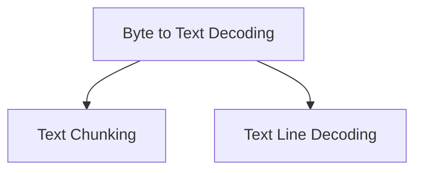

# `text_stream_processors` Module Documentation

## Introduction

The `text_stream_processors` module in `httpx._decoders` is responsible for handling the processing of textual data streams. It provides utilities for incrementally decoding byte streams into text, chunking text into fixed-size segments, and extracting lines from text content. This module is crucial for efficiently handling and manipulating streaming text data within the HTTPX library.

## Architecture

The `text_stream_processors` module is composed of several key sub-modules, each serving a distinct purpose in text stream manipulation. The overall architecture is designed to allow flexible processing pipelines, where byte streams can first be decoded into text, and then further processed into chunks or lines as required.

<!-- DIAGRAM_JSON
{
    "direction": "TD",
    "nodes": [
        {"id": "byte_to_text_decoding", "label": "Byte to Text Decoding", "type": "module", "link": "byte_to_text_decoding.md"},
        {"id": "text_chunking", "label": "Text Chunking", "type": "module", "link": "text_chunking.md"},
        {"id": "text_line_decoding", "label": "Text Line Decoding", "type": "module", "link": "text_line_decoding.md"}
    ],
    "edges": [
        {"source": "byte_to_text_decoding", "target": "text_chunking"},
        {"source": "byte_to_text_decoding", "target": "text_line_decoding"}
    ],
    "groups": []
}
-->

## Sub-modules

### [Byte to Text Decoding](byte_to_text_decoding.md)
This sub-module, primarily implemented by `httpx._decoders.TextDecoder`, handles the incremental conversion of byte streams into human-readable text. It supports various encodings, ensuring correct character representation from raw byte data.

### [Text Chunking](text_chunking.md)
The `text_chunking` sub-module, leveraging `httpx._decoders.TextChunker`, is designed to process text content into fixed-size chunks. This is particularly useful for scenarios where text needs to be processed or transmitted in manageable, consistent blocks.

### [Text Line Decoding](text_line_decoding.md)
With `httpx._decoders.LineDecoder` as its core, this sub-module provides functionality for incrementally reading and buffering lines from a text stream. It mirrors the behavior of Python's `str.splitlines`, making it suitable for line-by-line processing of text.
