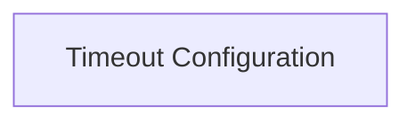

# Timeout Configuration

Manages various timeout settings for HTTPX requests, including connect, read, write, and pool timeouts.

## Components

This module contains 1 component(s):

- `httpx._config.Timeout`

## Structure

---
*This documentation was auto-generated to ensure completeness.*
