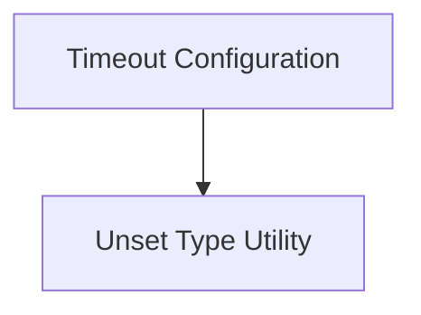

# Timeout Settings Module

The `timeout_settings` module in HTTPX is responsible for managing all aspects of request timeouts. It provides a flexible way to configure connection, read, write, and pool timeouts, ensuring robust handling of network operations and preventing indefinite waits. This module is a crucial part of the overall [configuration](configuration.md) system, specifically focusing on the time-based constraints for HTTP requests.

## Architecture

The `timeout_settings` module is composed of two primary components:

<!-- DIAGRAM_JSON
{
    "direction": "TD",
    "nodes": [
        {"id": "timeout_configuration", "label": "Timeout Configuration", "type": "module", "link": "timeout_configuration.md"},
        {"id": "unset_type_utility", "label": "Unset Type Utility", "type": "module", "link": "unset_type_utility.md"}
    ],
    "edges": [
        {"source": "timeout_configuration", "target": "unset_type_utility"}
    ],
    "groups": []
}
-->

## Sub-modules

### [Timeout Configuration](timeout_configuration.md)
This sub-module, primarily handled by `httpx._config.Timeout`, manages various timeout settings for HTTPX requests, including connect, read, write, and pool timeouts. It offers a comprehensive mechanism for defining how long the client should wait for different phases of a request before timing out.

### [Unset Type Utility](unset_type_utility.md)
The `unset_type_utility` sub-module, represented by `httpx._config.UnsetType`, provides a simple utility class used to represent an unset or unspecified value in configuration settings. This is particularly useful in the `Timeout` class to differentiate between explicitly set `None` and a value that has not been configured.