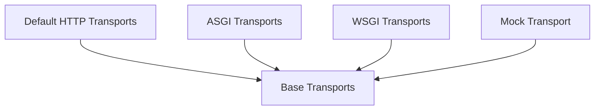

# Transports Module Documentation

The `transports` module in `httpx` is responsible for the low-level mechanics of sending HTTP requests over the network and receiving responses. It provides an abstraction layer over different underlying communication protocols and application interfaces, such as HTTP/1.1, HTTP/2, ASGI, and WSGI. This module allows `httpx` to be highly flexible, supporting various deployment and integration scenarios, from standard network requests to direct communication with Python web applications.

## Architecture Overview

The `transports` module is designed with extensibility in mind, using base classes to define common interfaces for different transport mechanisms. Specific transport implementations then handle the details of various protocols or application environments.

<!-- DIAGRAM_JSON
{
    "direction": "TD",
    "nodes": [
        {"id": "base_transports", "label": "Base Transports", "type": "module", "link": "base_transports.md"},
        {"id": "default_http_transports", "label": "Default HTTP Transports", "type": "module", "link": "default_http_transports.md"},
        {"id": "asgi_transports", "label": "ASGI Transports", "type": "module", "link": "asgi_transports.md"},
        {"id": "wsgi_transports", "label": "WSGI Transports", "type": "module", "link": "wsgi_transports.md"},
        {"id": "mock_transport", "label": "Mock Transport", "type": "module", "link": "mock_transport.md"}
    ],
    "edges": [
        {"source": "default_http_transports", "target": "base_transports"},
        {"source": "asgi_transports", "target": "base_transports"},
        {"source": "wsgi_transports", "target": "base_transports"},
        {"source": "mock_transport", "target": "base_transports"}
    ],
    "groups": []
}
-->

## Sub-modules

### [ASGI Transports](asgi_transports.md)
Implements transports for interfacing with ASGI (Asynchronous Server Gateway Interface) applications, allowing HTTPX to send requests directly to ASGI apps.

### [Base Transports](base_transports.md)
Defines the abstract base classes for synchronous and asynchronous HTTP transports, outlining the fundamental interfaces for handling requests and closing connections.

### [Default HTTP Transports](default_http_transports.md)
Provides the concrete implementations for synchronous and asynchronous HTTP transports, handling standard HTTP/1.1 and HTTP/2 connections, proxies, and SSL contexts.

### [Mock Transport](mock_transport.md)
Offers a flexible transport for mocking HTTP requests and responses, useful for testing and development scenarios.

### [WSGI Transports](wsgi_transports.md)
Provides transports for interacting with WSGI (Web Server Gateway Interface) applications, enabling HTTPX to send requests to WSGI apps.