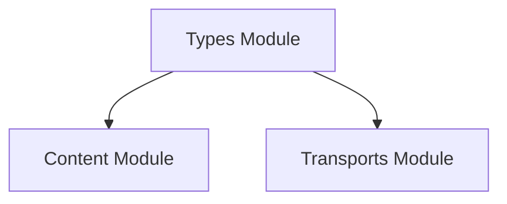

# types

The `types` module in HTTPX defines fundamental type hints and abstract base classes that serve as interfaces for various data structures and stream handling mechanisms throughout the library. Its primary purpose is to ensure type consistency and provide clear contracts for how different components, especially those dealing with byte streams, should interact.

## Architecture

This module provides core interfaces consumed by other parts of the HTTPX library, such as the `content` module (for representing request/response bodies) and the `transports` module (for handling actual data transmission).

<!-- DIAGRAM_JSON
{
    "direction": "TD",
    "nodes": [
        {"id": "types", "label": "Types Module", "type": "module"},
        {"id": "content", "label": "Content Module", "type": "external", "link": "content.md"},
        {"id": "transports", "label": "Transports Module", "type": "external", "link": "transports.md"}
    ],
    "edges": [
        {"source": "types", "target": "content"},
        {"source": "types", "target": "transports"}
    ],
    "groups": []
}
-->

## Core Functionality

The `types` module defines the following key interfaces:

### SyncByteStream

The `SyncByteStream` is an abstract base class that provides an interface for synchronously iterating over a stream of bytes. It defines the `__iter__` method, which should yield `bytes` objects, and a `close` method for releasing resources. This interface is crucial for handling request and response bodies in a synchronous context, allowing for efficient processing of potentially large data streams without loading everything into memory at once.

### AsyncByteStream

Similar to `SyncByteStream`, `AsyncByteStream` is an abstract base class designed for asynchronously iterating over a stream of bytes. It defines the `__aiter__` method, an asynchronous iterator that yields `bytes` objects, and an `aclose` method for asynchronous resource cleanup. This interface is essential for non-blocking I/O operations, particularly in asynchronous applications where efficient handling of network streams is critical.
