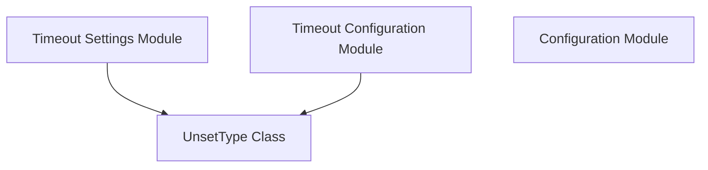

# Module: `unset_type_utility`

## Introduction
The `unset_type_utility` module introduces `UnsetType`, a crucial sentinel object within the `httpx` library. This utility class is designed to provide a clear distinction between a configuration parameter that has been explicitly set to `None` and one that has not been set at all. This differentiation is vital for flexible and robust configuration management, particularly in scenarios where default values should only be applied when an option is truly omitted.

## Purpose and Core Functionality
The core functionality of `unset_type_utility` revolves around the `UnsetType` class. `UnsetType` is an empty class used as a singleton instance to represent an "unset" state for configurable options. In `httpx`, various configuration parameters, especially within the [configuration](configuration.md) module and its sub-modules like [timeout_settings](timeout_settings.md), might have default values that should only come into play if the user hasn't provided a value.

Without `UnsetType`, it would be ambiguous whether `None` means "no value specified, use default" or "explicitly set to null". `UnsetType` resolves this by acting as a unique indicator for "not specified".

**Key use cases include:**
*   **Default Value Handling:** Allowing `httpx` to intelligently apply default settings only when a parameter is truly omitted by the user.
*   **API Flexibility:** Providing a clear semantic for configuration options that can either be set, explicitly nulled, or left unset.

**Core Component:**
*   `httpx._config.UnsetType`: The singleton class representing an unset configuration value.

## Architecture and Component Relationships

The `unset_type_utility` module, specifically the `UnsetType` class, is a foundational utility primarily consumed by other modules responsible for `httpx` configuration. It is a direct child of `timeout_settings` and plays an indirect role in the broader [configuration](configuration.md) system.

<!-- DIAGRAM_JSON
{
    "direction": "TD",
    "nodes": [
        {"id": "unset_type", "label": "UnsetType Class", "type": "component", "link": null},
        {"id": "timeout_settings", "label": "Timeout Settings Module", "type": "external", "link": "timeout_settings.md"},
        {"id": "timeout_configuration", "label": "Timeout Configuration Module", "type": "external", "link": "timeout_configuration.md"},
        {"id": "configuration", "label": "Configuration Module", "type": "external", "link": "configuration.md"}
    ],
    "edges": [
        {"source": "timeout_settings", "target": "unset_type"},
        {"source": "timeout_configuration", "target": "unset_type"}
    ],
    "groups": []
}
-->

## How the Module Fits into the Overall System
The `unset_type_utility` module is a small but critical piece of the `httpx` configuration infrastructure. It ensures that configuration decisions, especially those involving default values, are made with precision, avoiding ambiguity between `None` and an omitted parameter.

It is particularly relevant to:
*   **[timeout_settings](timeout_settings.md):** As a direct child module, `timeout_settings` relies on `UnsetType` to manage the various timeout parameters (e.g., `connect_timeout`, `read_timeout`) where `None` might mean "disable timeout" versus `UnsetType` meaning "use default timeout".
*   **[timeout_configuration](timeout_configuration.md):** This sibling module also leverages `UnsetType` to correctly interpret and apply timeout values.
*   **[configuration](configuration.md):** The broader `configuration` module benefits from the clear distinction provided by `UnsetType` when processing global or client-specific settings, ensuring consistent behavior across the library.

By providing a robust mechanism for handling unset values, `unset_type_utility` contributes to the overall stability, predictability, and user-friendliness of `httpx`'s configuration API.