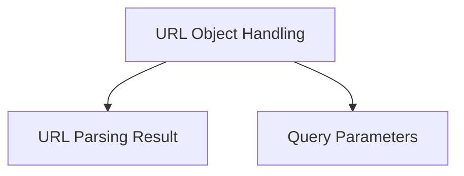

# URL Parsing and Manipulation Module

## Introduction and Purpose

The `url_parsing_and_manipulation` module provides robust functionalities for parsing, constructing, and manipulating URLs within the system. It handles the decomposition of URLs into their constituent parts and offers a comprehensive `URL` object for easier interaction and modification of URL components.

## Architecture Overview

The module is composed of two primary sub-modules:

*   **[URL Parsing Result](url_parsing_result.md)**: Defines the structure for parsed URL components.
*   **[URL Object Handling](url_object_handling.md)**: Provides a comprehensive class for URL construction, parsing, and manipulation.

These components work together to ensure consistent and accurate URL handling across the application.

<!-- DIAGRAM_JSON
{
    "direction": "TD",
    "nodes": [
        {"id": "url_parsing_result", "label": "URL Parsing Result", "type": "module", "link": "url_parsing_result.md"},
        {"id": "url_object_handling", "label": "URL Object Handling", "type": "module", "link": "url_object_handling.md"},
        {"id": "query_parameters", "label": "Query Parameters", "type": "module", "link": "query_parameters.md"}
    ],
    "edges": [
        {"source": "url_object_handling", "target": "url_parsing_result"},
        {"source": "url_object_handling", "target": "query_parameters"}
    ],
    "groups": []
}
-->

## Sub-module Functionality

### URL Parsing Result

This sub-module, primarily through the `ParseResult` named tuple, defines a structured way to represent the various components of a parsed URL. It allows for easy access to the scheme, user information, host, port, path, query, and fragment, and provides utility properties like `authority` and `netloc`. It also includes a `copy_with` method for creating new `ParseResult` instances with modified attributes.

### URL Object Handling

This sub-module, centered around the `URL` class, provides a high-level interface for working with URLs. It encapsulates the `ParseResult` and offers a rich set of properties for accessing normalized and raw URL components such as `scheme`, `host`, `port`, `path`, `query`, `username`, `password`, and `fragment`. The `URL` class also provides methods for copying with modifications (`copy_with`), manipulating query parameters (`copy_set_param`, `copy_add_param`, `copy_remove_param`, `copy_merge_params`), and joining URLs (`join`). It integrates with the [Query Parameters module](query_parameters.md) for handling query string data efficiently.
