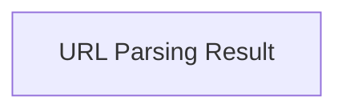

# URL Parsing Result

Defines the structure for parsed URL components, providing properties for easy access and manipulation.

## Components

This module contains 1 component(s):

- `httpx._urlparse.ParseResult`

## Structure

---
*This documentation was auto-generated to ensure completeness.*
