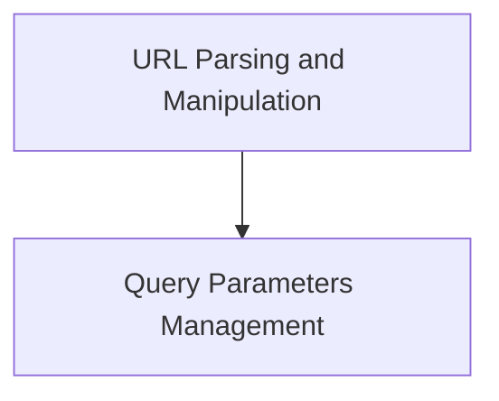

# URLs Module Documentation

The `urls` module in `httpx` is responsible for handling URL parsing, representation, and manipulation. It provides robust tools for working with various components of a URL, including schemes, hosts, paths, and query parameters, ensuring consistency and correctness in URL handling across the library.

## Architecture Overview

The module is structured into components that handle the fundamental parsing of URLs into structured parts and the management of URL query parameters.

<!-- DIAGRAM_JSON
{
    "direction": "TD",
    "nodes": [
        {"id": "url_parsing_and_manipulation", "label": "URL Parsing and Manipulation", "type": "module", "link": "url_parsing_and_manipulation.md"},
        {"id": "query_parameters", "label": "Query Parameters Management", "type": "module", "link": "query_parameters.md"}
    ],
    "edges": [
        {"source": "url_parsing_and_manipulation", "target": "query_parameters", "label": "Utilizes"}
    ],
    "groups": []
}
-->

## Sub-module Functionality

*   **URL Parsing and Manipulation**: This sub-module provides the core `ParseResult` and `URL` classes for breaking down URLs into their components (scheme, host, path, query, etc.) and for constructing, validating, and modifying URL objects. It ensures proper handling of various URL formats, including internationalized domain names and userinfo. See [url_parsing_and_manipulation.md](url_parsing_and_manipulation.md) for more details.

*   **Query Parameters Management**: This sub-module, primarily through the `QueryParams` class, offers an immutable multi-dict interface for managing URL query parameters. It allows for safe and consistent manipulation of query strings, supporting operations like setting, adding, removing, and merging parameters. See [query_parameters.md](query_parameters.md) for more details.
